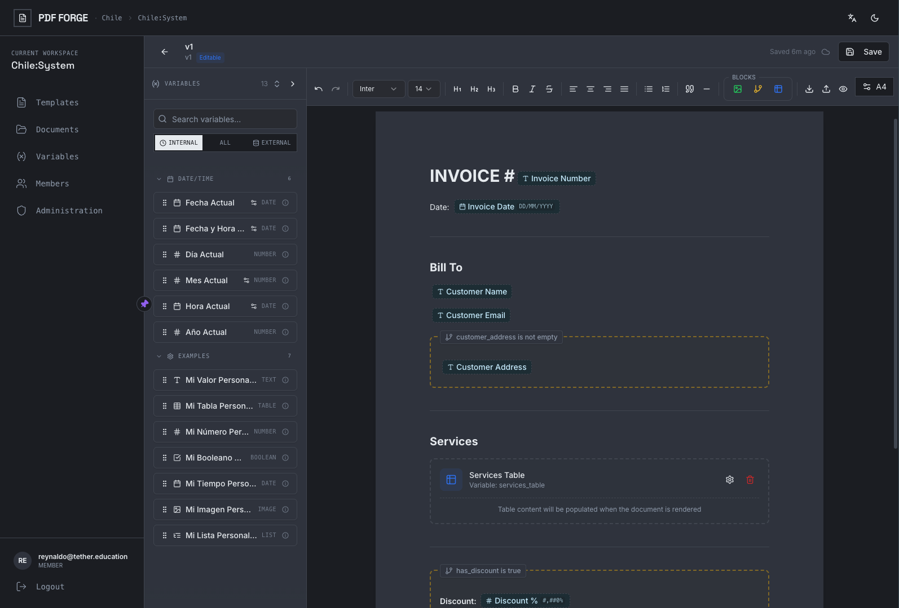
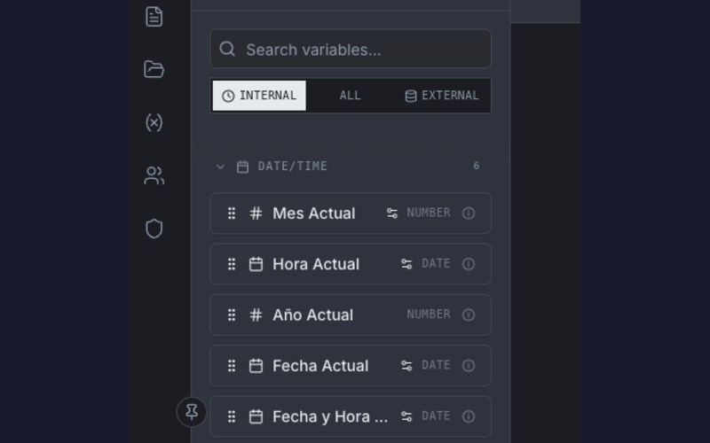

<p align="center">
  
</p>

<p align="center">
  <strong>Multi-tenant PDF template engine powered by Typst</strong><br>
  <sub>Agent-Friendly · Extensible · Production-Ready</sub>
</p>

<p align="center">
  <a href="https://go.dev"></a>
  <a href="LICENSE"></a>
  <a href="https://pkg.go.dev/github.com/rendis/pdf-forge"></a>
  <a href="#ai-agent-skill"></a>
</p>

<p align="center">
  
</p>

---

Build document templates visually, inject dynamic data through plugins, generate PDFs on demand. Ships with React editor, multi-tenant RBAC, and OIDC auth.

## Screenshots

<p align="center">
<table>
  <tr>
    <td align="center"><br><sub>Template Management</sub></td>
    <td align="center"><br><sub>Variable Injection</sub></td>
  </tr>
  <tr>
    <td align="center"><br><sub>PDF Preview</sub></td>
    <td align="center"><br><sub>Administration</sub></td>
  </tr>
</table>
</p>

## How It Works

pdf-forge follows a **plugin-based architecture**:

1. **Templates** - Create document templates in the visual editor with placeholders for dynamic content
2. **Injectables** - Define variables (text, numbers, tables, images) that populate those placeholders
3. **Injectors** - Write Go plugins that resolve variable values from any data source (CRM, DB, API)
4. **Render** - Call the API with your payload, get a PDF back

```plaintext
┌──────────────────┐      ┌──────────────────┐      ┌──────────────────┐
│     Template     │      │    Injectors     │      │       PDF        │
│   (Visual Editor)│  ──▶ │    (Go Plugins)  │  ──▶ │     (Typst)      │
│                  │      │                  │      │                  │
│  Placeholders:   │      │  Resolve values  │      │  Final document  │
│  {{customer}}    │      │  from any source │      │  with real data  │
│  {{items_table}} │      │                  │      │                  │
└──────────────────┘      └──────────────────┘      └──────────────────┘
```

The engine handles dependency resolution, concurrent rendering, image caching, and multi-tenant isolation automatically.

## Features

| Feature                 | Description                                          |
| ----------------------- | ---------------------------------------------------- |
| **Visual Editor**       | TipTap-based rich text with live PDF preview         |
| **Plugin Architecture** | Custom injectors for any data source (CRM, DB, API)  |
| **7 Value Types**       | String, Number, Bool, Time, Table, Image, List       |
| **Typst Rendering**     | Fast concurrent PDF generation with image caching    |
| **Multi-Tenant**        | Tenant/workspace isolation with 3-level RBAC         |
| **Multi-OIDC**          | Support N identity providers (Keycloak, Auth0, etc.) |
| **Embedded Frontend**   | React 19 SPA ships with engine - no separate deploy  |
| **CLI Scaffolding**     | `pdfforge-cli init` generates ready-to-run project   |
| **Lifecycle Hooks**     | `OnStart()` / `OnShutdown()` for background workers  |
| **Custom Middleware**   | Global + API-only middleware chains                  |
| **Dummy Auth**          | Dev mode without OIDC provider setup                 |
| **Dynamic Injectables** | Per-workspace runtime plugins via provider           |

## Quick Start

```bash
# Install CLI
go install github.com/rendis/pdf-forge/cmd/pdfforge-cli@latest

# Scaffold project
pdfforge-cli init myapp && cd myapp

# Run (app + PostgreSQL)
make up
```

Open [http://localhost:8080](http://localhost:8080)

<details>
<summary><strong>Prerequisites</strong></summary>

| Dependency | Version | Install                                   |
| ---------- | ------- | ----------------------------------------- |
| Go         | 1.25+   | [go.dev/dl](https://go.dev/dl/)           |
| PostgreSQL | 16+     | `brew install postgresql@16` or Docker    |
| Typst      | latest  | `brew install typst` (included in Docker) |

</details>

<details>
<summary><strong>Manual Setup</strong></summary>

```bash
# Start PostgreSQL only
make up-db

# Run locally (migrations auto-apply)
make run

# Custom PG port
PG_PORT=5433 make up
```

</details>

## Configuration

```yaml
# config/app.yaml
server:
  port: "8080"

database:
  host: localhost
  port: 5432
  name: pdf_forge

typst:
  bin_path: typst
  max_concurrent: 20

# auth: omit for dummy mode (dev)
```

Environment variables override YAML with `DOC_ENGINE_` prefix:

| Variable                       | Description       |
| ------------------------------ | ----------------- |
| `DOC_ENGINE_DATABASE_HOST`     | Database hostname |
| `DOC_ENGINE_DATABASE_PASSWORD` | Database password |
| `DOC_ENGINE_SERVER_PORT`       | Server port       |

See [Configuration Guide](docs/configuration.md) for OIDC, logging, and advanced options.

## Docker

The scaffolded project includes Docker support:

```bash
# Full stack (app + PostgreSQL)
make up

# Only database (for local dev)
make up-db

# Build image manually
docker build -t myapp .

# Use external PostgreSQL
docker compose up --scale postgres=0
```

The multi-stage `Dockerfile` includes Go 1.25 and Typst CLI.

## AI Agent Skill

pdf-forge is **agent-friendly**. Install the skill to let AI agents (Claude Code, Cursor, etc.) build and extend your project with full context:

```bash
npx skills add https://github.com/rendis/pdf-forge --skill pdf-forge
```

The skill provides:

- Architecture patterns and coding conventions
- API reference and endpoint documentation
- Injector, mapper, and extension patterns
- Database schema and migration guidance

## Use Cases

| Use Case                    | Example                                              |
| --------------------------- | ---------------------------------------------------- |
| **Invoices & Billing**      | Dynamic line items, totals, customer data            |
| **Certificates & Diplomas** | Names, dates, achievements                           |
| **Reports**                 | HR summaries, analytics dashboards, insurance claims |
| **Personalized Marketing**  | Customer-specific offers, localized content          |

## When NOT to Use

- WYSIWYG editor (Word-like) - this is template-based
- CMS or content management
- E-signature platform
- BI dashboards or reporting tools
- One-off documents without templates

## Architecture

```plaintext
POST /api/v1/workspace/document-types/{code}/render
     │
     ▼
┌─────────────────────────────────────────────────────┐
│  1. Mapper        Parse request payload             │
│  2. Init          Load shared data (CRM, DB)        │
│  3. Injectors     Resolve values (topological)      │
│  4. Typst         Generate PDF                      │
└─────────────────────────────────────────────────────┘
     │
     ▼
   PDF bytes
```

## Endpoints

| Route               | Description                 | Auth             |
| ------------------- | --------------------------- | ---------------- |
| `/`                 | Template editor (React SPA) | None             |
| `/api/v1/*`         | Management + render API     | OIDC JWT / Dummy |
| `/swagger/*`        | API documentation           | None             |
| `/health`, `/ready` | Health checks               | None             |

## Authentication

**Development (Dummy Mode)**: Omit `auth` in config - auto-seeds admin user, no tokens required.

**Production (OIDC)**: Configure providers in `app.yaml`:

```yaml
auth:
  panel:
    name: "keycloak"
    discovery_url: "https://auth.example.com/realms/web"
    client_id: "pdf-forge-web"

  render_providers: # Additional providers for render API only
    - name: "internal-services"
      discovery_url: "https://auth.example.com/realms/services"
```

**Supported providers**: Keycloak, Auth0, Okta, Azure AD, AWS Cognito, Firebase.

Token validation uses standard OIDC/JWKS - the `iss` claim determines which provider validates each request.

## Roles

Three-level RBAC: **System** > **Tenant** > **Workspace**

| Level     | Roles                                            |
| --------- | ------------------------------------------------ |
| System    | `SUPERADMIN`, `PLATFORM_ADMIN`                   |
| Tenant    | `TENANT_OWNER`, `TENANT_ADMIN`                   |
| Workspace | `OWNER`, `ADMIN`, `EDITOR`, `OPERATOR`, `VIEWER` |

See [Authorization Matrix](docs/authorization-matrix.md) for full permissions.

## Documentation

| Document                                             | Description                           |
| ---------------------------------------------------- | ------------------------------------- |
| [Architecture](docs/architecture.md)                 | Hexagonal design, domain organization |
| [Extensibility Guide](docs/extensibility-guide.md)   | Injectors, mappers, init functions    |
| [Configuration](docs/configuration.md)               | YAML config, OIDC setup               |
| [Value Types](docs/value-types.md)                   | String, Number, Table, Image, List    |
| [Authorization Matrix](docs/authorization-matrix.md) | RBAC roles and permissions            |
| [Database Schema](docs/database.md)                  | Multi-tenant model, ER diagrams       |
| [Deployment](docs/deployment.md)                     | Docker, Kubernetes patterns           |
| [Troubleshooting](docs/troubleshooting.md)           | Common issues and solutions           |

## Minimal Example

```go
package main

import (
    "log"
    "github.com/rendis/pdf-forge/sdk"
)

func main() {
    engine := sdk.New(sdk.WithConfigFile("config/app.yaml"))
    engine.RegisterInjector(&CustomerNameInjector{})
    if err := engine.Run(); err != nil {
        log.Fatal(err)
    }
}
```

## Writing an Injector

Injectors resolve dynamic values for template placeholders:

```go
type CustomerNameInjector struct{}

func (i *CustomerNameInjector) Code() string { return "customer_name" }

func (i *CustomerNameInjector) DataType() sdk.ValueType {
    return sdk.ValueTypeString
}

func (i *CustomerNameInjector) Resolve() (sdk.ResolveFunc, []string) {
    return func(ctx context.Context, injCtx *sdk.InjectorContext) (*sdk.InjectorResult, error) {
        // Get data from your source (DB, API, request payload)
        payload := injCtx.RequestPayload().(*MyPayload)
        return &sdk.InjectorResult{
            Value: sdk.StringValue(payload.CustomerName),
        }, nil
    }, nil // no dependencies (return codes here if this depends on other injectors)
}

// Required interface methods
func (i *CustomerNameInjector) IsCritical() bool            { return true }
func (i *CustomerNameInjector) Timeout() time.Duration     { return 5 * time.Second }
func (i *CustomerNameInjector) DefaultValue() *sdk.InjectableValue { return nil }
func (i *CustomerNameInjector) Formats() *sdk.FormatConfig { return nil }
```

See [Extensibility Guide](docs/extensibility-guide.md) for tables, images, lists, dependencies, and request mappers.

## CLI Reference

```bash
pdfforge-cli              # Interactive mode
pdfforge-cli init <name>  # Scaffold project
pdfforge-cli migrate      # Apply migrations
pdfforge-cli doctor       # Check prerequisites
```

## Contributing

```bash
make build    # Build
make test     # Tests
make lint     # Linter
make swagger  # Regenerate OpenAPI
```

## License

[MIT](LICENSE)
