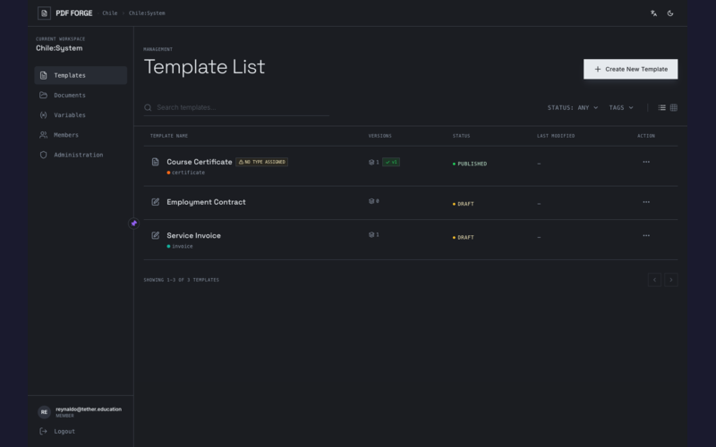
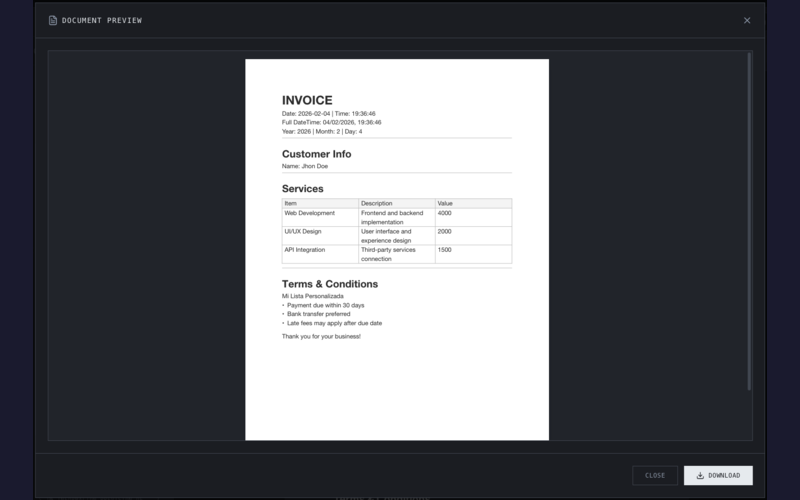
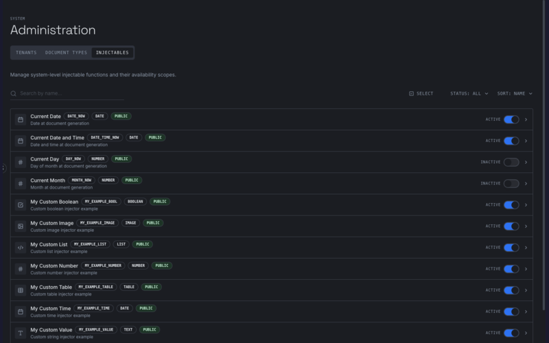

<p align="center">
  
</p>

<p align="center">
  <strong>Multi-tenant PDF template engine powered by Typst</strong><br>
  <sub>Forkeable · Agent-Friendly · Extensible · Production-Ready</sub>
</p>

<p align="center">
  <a href="https://go.dev"></a>
  <a href="https://pkg.go.dev/github.com/rendis/pdf-forge"></a>
  <a href="LICENSE"></a>
  <a href="https://goreportcard.com/report/github.com/rendis/pdf-forge"></a>
  <a href="https://github.com/rendis/pdf-forge/actions/workflows/github-code-scanning/codeql"></a>
  <a href="https://github.com/rendis/pdf-forge/releases"></a>
  <a href="https://github.com/rendis/pdf-forge/commits/main"></a>
  <a href="https://github.com/rendis/pdf-forge"></a>
  <a href="https://github.com/rendis/pdf-forge/graphs/contributors"></a>
  <a href="#ai-agent-skill"></a>
  <a href="https://deepwiki.com/rendis/pdf-forge"></a>
</p>

<p align="center">
  
</p>

---

Build document templates visually, inject dynamic data through plugins, generate PDFs on demand. Ships with React editor, multi-tenant RBAC, and OIDC auth.

## Table of Contents

- [Screenshots](#screenshots)
- [How It Works](#how-it-works)
- [Features](#features)
- [Tech Stack](#tech-stack)
- [Quick Start](#quick-start)
- [Local Development](#local-development)
- [Fork Workflow](#fork-workflow)
- [Project Structure](#project-structure)
- [SDK (Public API)](#sdk-public-api)
- [Customizing](#customizing-coreextensions)
- [Writing an Injector](#writing-an-injector)
- [Configuration](#configuration)
- [Environment Variables](#environment-variables)
- [Docker](#docker)
- [Authentication](#authentication)
- [Roles](#roles)
- [Architecture](#architecture)
- [Endpoints](#endpoints)
- [Commands](#commands)
- [Documentation](#documentation)
- [AI Agent Skill](#ai-agent-skill)
- [Contributing](#contributing)
- [License](#license)

## Screenshots

<p align="center">
<table>
  <tr>
    <td align="center"><br><sub>Template Management</sub></td>
    <td align="center"><br><sub>Variable Injection</sub></td>
  </tr>
  <tr>
    <td align="center"><br><sub>PDF Preview</sub></td>
    <td align="center"><br><sub>Administration</sub></td>
  </tr>
</table>
</p>

## How It Works

pdf-forge follows a **plugin-based architecture**:

1. **Templates** - Create document templates in the visual editor with placeholders for dynamic content
2. **Injectables** - Define variables (text, numbers, tables, images) that populate those placeholders
3. **Injectors** - Write Go plugins that resolve variable values from any data source (CRM, DB, API)
4. **Render** - Call the API with your payload, get a PDF back

```plaintext
┌──────────────────┐      ┌──────────────────┐      ┌──────────────────┐
│     Template     │      │    Injectors     │      │       PDF        │
│   (Visual Editor)│  ──▶ │    (Go Plugins)  │  ──▶ │     (Typst)      │
│                  │      │                  │      │                  │
│  Placeholders:   │      │  Resolve values  │      │  Final document  │
│  {{customer}}    │      │  from any source │      │  with real data  │
│  {{items_table}} │      │                  │      │                  │
└──────────────────┘      └──────────────────┘      └──────────────────┘
```

## Features

| Feature                  | Description                                          |
| ------------------------ | ---------------------------------------------------- |
| **Visual Editor**        | TipTap-based rich text with live PDF preview         |
| **Plugin Architecture**  | Custom injectors for any data source (CRM, DB, API)  |
| **7 Value Types**        | String, Number, Bool, Time, Table, Image, List       |
| **Typst Rendering**      | Fast concurrent PDF generation with image caching    |
| **Multi-Tenant**         | Tenant/workspace isolation with 3-level RBAC         |
| **Multi-OIDC**           | Support N identity providers (Keycloak, Auth0, etc.) |
| **Independent Frontend** | React 19 SPA with nginx, separately deployable       |
| **Forkeable**            | Fork, customize `core/extensions/`, deploy           |
| **Lifecycle Hooks**      | `OnStart()` / `OnShutdown()` for background workers  |
| **Custom Middleware**    | Global + API-only middleware chains                  |
| **Dummy Auth**           | Dev mode without OIDC provider setup                 |
| **Upgrade Doctor**       | `make check-upgrade` verifies safety before merging  |

## Tech Stack

| Layer     | Technology                                           |
| --------- | ---------------------------------------------------- |
| Backend   | Go 1.25, Gin, PostgreSQL 16, golang-migrate          |
| Rendering | Typst (concurrent PDF generation with image caching) |
| Frontend  | React 19, TypeScript, TanStack Router, Zustand       |
| UI        | Tailwind CSS, Radix UI, TipTap (rich text editor)    |
| Auth      | OIDC/JWKS (Keycloak, Auth0, Okta, Azure AD, etc.)    |
| Serving   | nginx (SPA + API reverse proxy)                      |
| Infra     | Docker Compose, multi-stage builds                   |

## Quick Start

### Option A: Scaffold (recommended)

Create a new project using the SDK — no fork needed:

```bash
# 1. Scaffold a new project
go run github.com/rendis/pdf-forge/core/cmd/init@latest my-project --module github.com/myorg/my-project

# 2. Set up
cd my-project
go mod tidy

# 3. Start everything (PostgreSQL + API + Frontend)
docker compose up --build
```

Local development (API only, no frontend):

```bash
make migrate
make dev
```

### Option B: Fork

```bash
# 1. Fork on GitHub: click "Fork" at github.com/rendis/pdf-forge

# 2. Clone your fork
git clone https://github.com/<you>/pdf-forge.git
cd pdf-forge

# 3. Set up upstream tracking
make init-fork

# 4. Start everything (PostgreSQL + API + Frontend)
docker compose up --build
```

**Endpoints**:

- Frontend: [http://localhost:8080](http://localhost:8080)
- API: [http://localhost:8080/api/v1](http://localhost:8080/api/v1)
- Swagger: [http://localhost:8080/swagger/index.html](http://localhost:8080/swagger/index.html)

### Local Development

**Prerequisites**:

| Dependency | Version | Install                                   |
| ---------- | ------- | ----------------------------------------- |
| Go         | 1.25+   | [go.dev/dl](https://go.dev/dl/)           |
| PostgreSQL | 16+     | `brew install postgresql@16` or Docker    |
| Typst      | latest  | `brew install typst` (included in Docker) |
| Node.js    | 22+     | [nodejs.org](https://nodejs.org/)         |
| pnpm       | latest  | `npm install -g pnpm`                     |

```bash
# Start only PostgreSQL via Docker
docker compose up postgres -d

# Apply database migrations
make migrate

# Run backend with hot reload (terminal 1)
make dev

# Run frontend dev server (terminal 2)
make dev-app

# Verify system deps and build health
make doctor
```

Dev mode uses **dummy auth** (no OIDC setup needed) — auto-seeds an admin user on first run.

## Fork Workflow

pdf-forge is designed to be forked and customized. You only modify `core/extensions/` — the engine handles the rest.

```plaintext
┌─────────────────────────────────────────────────────────────────┐
│                        SETUP (once)                             │
│                                                                 │
│  Fork on GitHub → git clone → make init-fork                    │
│                                                                 │
│  Customize:                                                     │
│    core/extensions/     ← Your injectors, mapper, middleware    │
│    core/settings/       ← Your config (DB, auth, CORS)          │
│                                                                 │
│  Deploy: docker compose up --build                              │
└─────────────────────────────────────────────────────────────────┘

┌─────────────────────────────────────────────────────────────────┐
│                    UPGRADE (per release)                        │
│                                                                 │
│  1. make check-upgrade VERSION=v1.2.0                           │
│     ✓ Merge conflicts....... ok                                 │
│     ✓ Build after merge..... ok                                 │
│     ✓ Interface changes..... ok                                 │
│     ✓ New migrations........ 2 new                              │
│                                                                 │
│  2. make sync-upstream VERSION=v1.2.0                           │
│  3. make build && make test                                     │
│  4. make migrate  (if new migrations)                           │
│  5. docker compose up --build                                   │
└─────────────────────────────────────────────────────────────────┘
```

**Your extensions are safe**: `.gitattributes` ensures your code in `core/extensions/` takes priority on merge conflicts. `check-upgrade` simulates the merge and verifies your code still compiles before you commit.

See **[FORKING.md](FORKING.md)** for the complete guide: Docker customization, Go module FAQ, alternative clone workflow, and contributing back.

## Project Structure

```plaintext
core/                            ← Backend Go (module: github.com/rendis/pdf-forge)
  sdk/                           ← PUBLIC API for external consumers (type aliases)
  cmd/api/                       ← Server entrypoint + bootstrap
  extensions/                    ← YOUR CODE: injectors, mapper, middleware, hooks
  internal/                      ← Engine internals (don't modify)
  settings/                      ← Default configuration
  docs/                          ← Architecture, auth, extensibility docs
  Makefile                       ← Backend-specific targets
  Dockerfile                     ← Backend Docker image
app/                             ← Frontend React SPA (independent service)
  src/                           ← React 19 + TypeScript + TanStack Router
  Makefile                       ← Frontend-specific targets
  Dockerfile                     ← Frontend Docker image (multi-stage: node + nginx)
  nginx.conf                     ← SPA fallback + API reverse proxy
Makefile                         ← Root orchestrator (delegates to core/ and app/)
docker-compose.yaml              ← Full stack: postgres + api + web
```

**You only need to modify `core/extensions/`** to customize the engine.

## SDK (Public API)

External consumers import `github.com/rendis/pdf-forge/core/sdk` — a single package that re-exports all extension types without exposing internal implementation:

```go
import "github.com/rendis/pdf-forge/core/sdk"

engine := sdk.New()
engine.RegisterInjector(&MyInjector{})
engine.SetMapper(&MyMapper{})
engine.Run()
```

The SDK exposes:

| Category       | Types                                                                                   |
| -------------- | --------------------------------------------------------------------------------------- |
| **Engine**     | `Engine`, `New()`, `NewWithConfig()`                                                    |
| **Interfaces** | `Injector`, `RequestMapper`, `WorkspaceInjectableProvider`, `RenderAuthenticator`       |
| **Types**      | `InjectorContext`, `InjectorResult`, `InjectableValue`, `MapperContext`, `FormatConfig` |
| **Values**     | `StringValue()`, `NumberValue()`, `BoolValue()`, `TimeValue()`, `ImageValue()`          |
| **Tables**     | `TableValue`, `TableColumn`, `Cell()`, `NewTableValue()`                                |
| **Lists**      | `ListValue`, `ListSchema`, `NewListValue()`, `ListItemValue()`                          |
| **Design**     | `TypstDesignTokens`, `DefaultDesignTokens()`                                            |
| **Constants**  | `ValueType*`, `InjectableDataType*`, `ListSymbol*`                                      |

> **Note**: Code inside `core/extensions/` (within the module) can import `internal/` directly. The `sdk` package is for external module consumers and forks.

## Customizing (`core/extensions/`)

All user customization lives in `core/extensions/register.go`:

```go
package extensions

import (
    "github.com/rendis/pdf-forge/core/cmd/api/bootstrap"
    "github.com/rendis/pdf-forge/core/extensions/injectors"
)

func Register(engine *bootstrap.Engine) {
    // Register custom injectors
    engine.RegisterInjector(&injectors.MyInjector{})

    // Set request mapper
    engine.SetMapper(&MyMapper{})

    // Set init function (runs before injectors on each render)
    engine.SetInitFunc(MyInit())

    // Add middleware
    engine.UseMiddleware(RequestLoggerMiddleware())
    engine.UseAPIMiddleware(TenantValidationMiddleware())

    // Lifecycle hooks
    engine.OnStart(func(ctx context.Context) error { return nil })
    engine.OnShutdown(func(ctx context.Context) error { return nil })
}
```

See the stub files in `core/extensions/` for documented examples of each extension point.

## Writing an Injector

Injectors resolve dynamic values for template placeholders:

```go
package injectors

import (
    "context"
    "time"

    "github.com/rendis/pdf-forge/core/sdk"
)

type CustomerNameInjector struct{}

func (i *CustomerNameInjector) Code() string { return "customer_name" }

func (i *CustomerNameInjector) DataType() sdk.ValueType {
    return sdk.ValueTypeString
}

func (i *CustomerNameInjector) Resolve() (sdk.ResolveFunc, []string) {
    return func(ctx context.Context, injCtx *sdk.InjectorContext) (*sdk.InjectorResult, error) {
        payload := injCtx.RequestPayload().(*MyPayload)
        return &sdk.InjectorResult{
            Value: sdk.StringValue(payload.CustomerName),
        }, nil
    }, nil // no dependencies
}

func (i *CustomerNameInjector) IsCritical() bool                      { return true }
func (i *CustomerNameInjector) Timeout() time.Duration                { return 5 * time.Second }
func (i *CustomerNameInjector) DefaultValue() *sdk.InjectableValue    { return nil }
func (i *CustomerNameInjector) Formats() *sdk.FormatConfig            { return nil }
```

See [Extensibility Guide](core/docs/extensibility-guide.md) for tables, images, lists, dependencies, and request mappers.

## Configuration

```yaml
# core/settings/app.yaml
server:
  port: "8080"
  cors:
    allowed_origins: ["*"]

database:
  host: localhost
  port: 5432
  name: pdf_forge

typst:
  bin_path: typst
  max_concurrent: 20

# auth: omit for dummy mode (dev)
```

### Environment Variables

Override any YAML key with `DOC_ENGINE_` prefix (e.g., `database.host` → `DOC_ENGINE_DATABASE_HOST`):

**Server**

| Variable                             | Default | Description                 |
| ------------------------------------ | ------- | --------------------------- |
| `DOC_ENGINE_SERVER_PORT`             | `8080`  | HTTP port                   |
| `DOC_ENGINE_SERVER_READ_TIMEOUT`     | `30`    | Read timeout (seconds)      |
| `DOC_ENGINE_SERVER_WRITE_TIMEOUT`    | `30`    | Write timeout (seconds)     |
| `DOC_ENGINE_SERVER_SHUTDOWN_TIMEOUT` | `10`    | Graceful shutdown (seconds) |

**Database**

| Variable                            | Default     | Description          |
| ----------------------------------- | ----------- | -------------------- |
| `DOC_ENGINE_DATABASE_HOST`          | `localhost` | PostgreSQL host      |
| `DOC_ENGINE_DATABASE_PORT`          | `5432`      | PostgreSQL port      |
| `DOC_ENGINE_DATABASE_USER`          | `postgres`  | DB user              |
| `DOC_ENGINE_DATABASE_PASSWORD`      | `""`        | DB password          |
| `DOC_ENGINE_DATABASE_NAME`          | `pdf_forge` | DB name              |
| `DOC_ENGINE_DATABASE_SSL_MODE`      | `disable`   | SSL mode             |
| `DOC_ENGINE_DATABASE_MAX_POOL_SIZE` | `10`        | Max open connections |

**Typst (Rendering)**

| Variable                                   | Default | Description                      |
| ------------------------------------------ | ------- | -------------------------------- |
| `DOC_ENGINE_TYPST_BIN_PATH`                | `typst` | Path to Typst binary             |
| `DOC_ENGINE_TYPST_MAX_CONCURRENT`          | `20`    | Max parallel renders             |
| `DOC_ENGINE_TYPST_TIMEOUT_SECONDS`         | `10`    | Max time per render              |
| `DOC_ENGINE_TYPST_ACQUIRE_TIMEOUT_SECONDS` | `5`     | Wait time for render slot        |
| `DOC_ENGINE_TYPST_IMAGE_CACHE_DIR`         | `""`    | Persistent image cache directory |

See [Configuration Guide](core/docs/configuration.md) for OIDC, logging, performance tuning, and all options.

## Docker

```bash
# Full stack (API + Frontend + PostgreSQL)
docker compose up --build

# Only database (for local dev)
docker compose up postgres

# Run migrations
make migrate
```

The stack runs three services:

- **postgres** (port 5432) - Database
- **api** (port 8080) - Go backend with Typst
- **web** (port 3000) - React frontend with nginx

Use `docker-compose.override.yaml` for local overrides (gitignored). See [FORKING.md](FORKING.md#docker-customization) for examples.

## Authentication

**Development (Dummy Mode)**: Omit `auth` in config - auto-seeds admin user, no tokens required.

**Production (OIDC)**: Configure providers in `core/settings/app.yaml`:

```yaml
auth:
  panel:
    name: "keycloak"
    discovery_url: "https://auth.example.com/realms/web"
    client_id: "pdf-forge-web"

  render_providers: # Additional providers for render API only
    - name: "internal-services"
      discovery_url: "https://auth.example.com/realms/services"
```

**Supported providers**: Keycloak, Auth0, Okta, Azure AD, AWS Cognito, Firebase.

## Roles

Three-level RBAC: **System** > **Tenant** > **Workspace**

| Level     | Roles                                            |
| --------- | ------------------------------------------------ |
| System    | `SUPERADMIN`, `PLATFORM_ADMIN`                   |
| Tenant    | `TENANT_OWNER`, `TENANT_ADMIN`                   |
| Workspace | `OWNER`, `ADMIN`, `EDITOR`, `OPERATOR`, `VIEWER` |

See [Authorization Matrix](core/docs/authorization-matrix.md) for full permissions.

## Architecture

```plaintext
POST /api/v1/workspace/document-types/{code}/render
     │
     ▼
┌─────────────────────────────────────────────────────┐
│  1. Mapper        Parse request payload             │
│  2. Init          Load shared data (CRM, DB)        │
│  3. Injectors     Resolve values (topological)      │
│  4. Typst         Generate PDF                      │
└─────────────────────────────────────────────────────┘
     │
     ▼
   PDF bytes
```

## Endpoints

| Route               | Description             | Auth             |
| ------------------- | ----------------------- | ---------------- |
| `/api/v1/*`         | Management + render API | OIDC JWT / Dummy |
| `/swagger/*`        | API documentation       | None             |
| `/health`, `/ready` | Health checks           | None             |

Frontend is served independently on port 3000 (nginx).

## Commands

```bash
# Build & Development
make build            # Build backend + frontend
make build-core       # Build Go backend only
make build-app        # Build React frontend only
make run              # Run API server
make dev              # Hot reload backend (air)
make dev-app          # Start Vite dev server
make migrate          # Apply database migrations
make test             # Run Go tests
make lint             # Run golangci-lint
make swagger          # Regenerate OpenAPI spec

# Docker
make docker-up        # Start all services with Docker Compose
make docker-down      # Stop all services

# Fork Workflow
make init-fork        # Set up upstream remote + merge drivers
make doctor           # Check system dependencies and build health
make check-upgrade    # Check if VERSION is safe to merge
make sync-upstream    # Merge upstream VERSION into current branch

make clean            # Remove all build artifacts
```

## Documentation

| Document                                                  | Description                           |
| --------------------------------------------------------- | ------------------------------------- |
| **[FORKING.md](FORKING.md)**                              | **Fork workflow, upgrading, FAQ**     |
| [Architecture](core/docs/architecture.md)                 | Hexagonal design, domain organization |
| [Extensibility Guide](core/docs/extensibility-guide.md)   | Injectors, mappers, init functions    |
| [Configuration](core/docs/configuration.md)               | YAML config, OIDC setup               |
| [Value Types](core/docs/value-types.md)                   | String, Number, Table, Image, List    |
| [Authorization Matrix](core/docs/authorization-matrix.md) | RBAC roles and permissions            |
| [Database Schema](core/docs/database.md)                  | Multi-tenant model, ER diagrams       |
| [Deployment](core/docs/deployment.md)                     | Docker, Kubernetes patterns           |
| [Troubleshooting](core/docs/troubleshooting.md)           | Rendering, auth, DB, frontend issues  |

## AI Agent Skill

pdf-forge is **agent-friendly**. Install the skill to let AI agents (Claude Code, Cursor, etc.) build and extend your project with full context:

```bash
npx skills add https://github.com/rendis/pdf-forge --skill pdf-forge
```

## Contributing

```bash
make build && make test && make lint
make swagger  # if API changed
```

See [FORKING.md](FORKING.md#contributing-back) for the PR workflow.

## License

[MIT](LICENSE)
