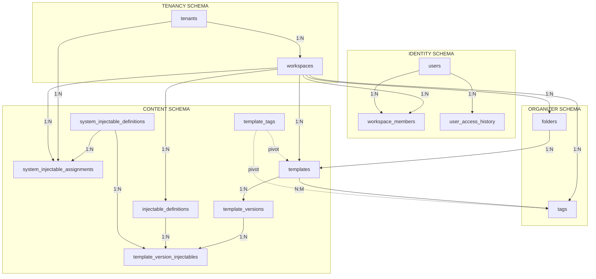
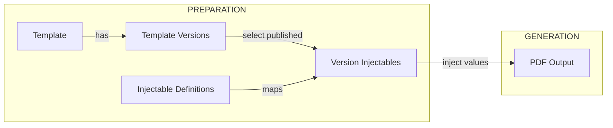

# PDF Forge - Database Model Documentation

## Table of Contents

1. [Overview](#1-overview)
2. [Architecture](#2-architecture)
3. [Entity Relationship Diagram](#3-entity-relationship-diagram)
4. [Schema Reference](#4-schema-reference)
5. [Table Reference](#5-table-reference)
6. [Cache Tables](#6-cache-tables)
7. [Enum Types](#7-enum-types)
8. [Indexes & Constraints](#8-indexes--constraints)
9. [Usage Examples](#9-usage-examples)

---

## 1. Overview

PDF Forge is a **multi-tenant document template builder** with on-demand PDF generation. It manages document templates, injects dynamic data (variables), and generates PDFs on demand without persisting generated documents.

### Key Capabilities

- **Template Management**: Create, version, and organize document templates
- **Variable Injection**: Define and inject dynamic data into documents
- **On-Demand PDF Generation**: Generate PDFs from published templates with injectable values
- **Multi-Tenant Architecture**: Support for multiple organizations with hierarchical workspace structure

### Design Principles

| Principle                  | Description                                                                                               |
| -------------------------- | --------------------------------------------------------------------------------------------------------- |
| **Multi-Tenant Hierarchy** | Two-level structure: System Tenant (global templates) → Regular Tenants (with SYSTEM + CLIENT workspaces) |
| **Shadow Users**           | Authentication delegated to external OIDC provider; database maintains shadow users for roles and audit   |
| **Hybrid Architecture**    | Relational SQL for organizational structure + JSONB for dynamic document content                          |
| **On-Demand Generation**   | PDFs are generated on the fly from published templates; no document persistence                           |

---

## 2. Architecture

### Multi-Tenant Hierarchy

```plaintext
┌─────────────────────────────────────────────────────────────────┐
│                    SYSTEM TENANT (is_system = TRUE)             │
│  ┌───────────────────────────────────────────────────────────┐  │
│  │  Tenant: System (code = 'SYS')                            │  │
│  │  ┌─────────────────────────────────────────────────────┐  │  │
│  │  │  System Workspace (type = 'SYSTEM')                 │  │  │
│  │  │  → Universal templates available to all tenants     │  │  │
│  │  └─────────────────────────────────────────────────────┘  │  │
│  │  Only 1 workspace allowed (type=SYSTEM only)              │  │
│  └───────────────────────────────────────────────────────────┘  │
├─────────────────────────────────────────────────────────────────┤
│                    REGULAR TENANTS (is_system = FALSE)          │
│  ┌──────────────────────┐  ┌──────────────────────┐             │
│  │  Tenant: Chile (CL)  │  │  Tenant: Mexico (MX) │             │
│  │  ┌────────────────┐  │  │  ┌────────────────┐  │             │
│  │  │ System WS      │  │  │  │ System WS      │  │             │
│  │  │ → Localized    │  │  │  │ → Localized    │  │             │
│  │  │   templates    │  │  │  │   templates    │  │             │
│  │  └────────────────┘  │  │  └────────────────┘  │             │
│  │  ┌────────────────┐  │  │  ┌────────────────┐  │             │
│  │  │ Client WS 1..N │  │  │  │ Client WS 1..N │  │             │
│  │  └────────────────┘  │  │  └────────────────┘  │             │
│  └──────────────────────┘  └──────────────────────┘             │
└─────────────────────────────────────────────────────────────────┘
```

### Schema Organization

| Schema      | Responsibility                                    |
| ----------- | ------------------------------------------------- |
| `tenancy`   | Infrastructure base: tenants and workspaces       |
| `identity`  | Users, authentication shadows, and permissions    |
| `organizer` | Resource classification: folders and tags         |
| `content`   | Template engine: templates, variables, versioning |

---

## 3. Entity Relationship Diagram

### High-Level Schema Relationships



### Detailed Entity Relationship Diagram

```mermaid
erDiagram
    %% ===== TENANCY SCHEMA =====
    tenants {
        uuid id PK "gen_random_uuid()"
        varchar_100 name "NOT NULL"
        varchar_10 code "UNIQUE NOT NULL"
        boolean is_system "NOT NULL DEFAULT false"
        jsonb settings "Regional config"
        timestamptz created_at "NOT NULL"
        timestamptz updated_at
    }

    workspaces {
        uuid id PK "gen_random_uuid()"
        uuid tenant_id FK "NOT NULL"
        varchar_255 name "NOT NULL"
        workspace_type type "NOT NULL"
        workspace_status status "DEFAULT ACTIVE"
        jsonb settings
        timestamptz created_at "NOT NULL"
        timestamptz updated_at
    }

    tenants ||--o{ workspaces : "houses"

    %% ===== IDENTITY SCHEMA =====
    users {
        uuid id PK "gen_random_uuid()"
        varchar_255 email "UNIQUE NOT NULL"
        varchar_255 external_identity_id "UNIQUE (OIDC sub)"
        varchar_255 full_name
        user_status status "DEFAULT INVITED"
        timestamptz created_at "NOT NULL"
    }

    workspace_members {
        uuid id PK "gen_random_uuid()"
        uuid workspace_id FK "NOT NULL"
        uuid user_id FK "NOT NULL"
        workspace_role role "NOT NULL"
        membership_status membership_status "DEFAULT PENDING"
        uuid invited_by FK
        timestamptz joined_at
        timestamptz created_at "NOT NULL"
    }

    user_access_history {
        uuid id PK "gen_random_uuid()"
        uuid user_id FK "NOT NULL"
        varchar_20 entity_type "NOT NULL CHECK"
        uuid entity_id "NOT NULL"
        timestamptz accessed_at "NOT NULL DEFAULT NOW"
    }

    workspaces ||--o{ workspace_members : "staffing"
    users ||--o{ workspace_members : "membership"
    users ||--o{ workspace_members : "invites"
    users ||--o{ user_access_history : "tracks"

    %% ===== ORGANIZER SCHEMA =====
    folders {
        uuid id PK "gen_random_uuid()"
        uuid workspace_id FK "NOT NULL"
        uuid parent_id FK "Recursive"
        varchar_255 name "NOT NULL"
        text path "NOT NULL (materialized)"
        timestamptz created_at "NOT NULL"
        timestamptz updated_at
    }

    tags {
        uuid id PK "gen_random_uuid()"
        uuid workspace_id FK "NOT NULL"
        varchar_50 name "NOT NULL"
        varchar_7 color "HEX format"
        timestamptz created_at "NOT NULL"
        timestamptz updated_at
    }

    workspaces ||--o{ folders : "contains"
    workspaces ||--o{ tags : "defines"
    folders ||--o{ folders : "hierarchy"

    %% ===== CONTENT SCHEMA =====
    injectable_definitions {
        uuid id PK "gen_random_uuid()"
        uuid workspace_id FK "NULL for global"
        varchar_100 key "NOT NULL"
        varchar_255 label "NOT NULL"
        text description
        injectable_data_type data_type "NOT NULL"
        text default_value "Optional default"
        jsonb metadata "DEFAULT {}"
        jsonb format_config "CHECK constraint"
        boolean is_active "DEFAULT TRUE"
        boolean is_deleted "DEFAULT FALSE"
        timestamptz created_at "NOT NULL"
        timestamptz updated_at
    }

    templates {
        uuid id PK "gen_random_uuid()"
        uuid workspace_id FK "NOT NULL"
        uuid folder_id FK
        varchar_255 title "NOT NULL"
        boolean is_public_library "DEFAULT false"
        timestamptz created_at "NOT NULL"
        timestamptz updated_at
    }

    template_versions {
        uuid id PK "gen_random_uuid()"
        uuid template_id FK "NOT NULL"
        int version_number "NOT NULL"
        varchar_100 name "NOT NULL"
        text description
        jsonb content_structure "Editor nodes"
        version_status status "DEFAULT DRAFT"
        timestamptz scheduled_publish_at
        timestamptz scheduled_archive_at
        timestamptz published_at
        timestamptz archived_at
        uuid published_by FK
        uuid archived_by FK
        uuid created_by FK
        timestamptz created_at "NOT NULL"
        timestamptz updated_at
    }

    template_version_injectables {
        uuid id PK "gen_random_uuid()"
        uuid template_version_id FK "NOT NULL"
        uuid injectable_definition_id FK "NOT NULL"
        boolean is_required "DEFAULT false"
        text default_value
        timestamptz created_at "NOT NULL"
    }

    template_tags {
        uuid template_id PK_FK "NOT NULL"
        uuid tag_id PK_FK "NOT NULL"
    }

    workspaces ||--o{ injectable_definitions : "owns"
    workspaces ||--o{ templates : "owns"
    folders ||--o{ templates : "organizes"
    templates ||--o{ template_versions : "has_versions"
    template_versions ||--o{ template_version_injectables : "requires"
    injectable_definitions ||--o{ template_version_injectables : "defined_by"
    templates ||--o{ template_tags : "tagged_with"
    tags ||--o{ template_tags : "applied_to"
    users ||--o{ template_versions : "publishes"
    users ||--o{ template_versions : "archives"
    users ||--o{ template_versions : "creates"

```

### PDF Generation Flow



> **Note**: PDF generation is on-demand. No documents are persisted in the database. The system renders a PDF from a published template version with the provided injectable values and returns it directly.

---

## 4. Schema Reference

### 4.1 Schema: `tenancy`

**Purpose**: Manages the foundational infrastructure for multi-tenant isolation and environment separation.

**Why it exists**: The system needs to support multiple independent organizations (tenants) while allowing shared resources at different hierarchy levels. This schema provides the structural foundation that all other schemas depend on.

| Table        | Description                                                  |
| ------------ | ------------------------------------------------------------ |
| `tenants`    | Represents jurisdictions, countries, or major business units |
| `workspaces` | The root operational entity where all work happens           |

---

### 4.2 Schema: `identity`

**Purpose**: Manages user identity, workspace membership, and role-based access control.

**Why it exists**: Authentication is delegated to an external OIDC provider, but the system still needs to track users internally for audit trails, role management, and workspace access. Shadow users solve this by mirroring external identities.

| Table                 | Description                                                |
| --------------------- | ---------------------------------------------------------- |
| `users`               | Shadow user records synced from external IdP               |
| `workspace_members`   | Maps users to workspaces with specific roles               |
| `user_access_history` | Tracks recent tenant/workspace access for quick navigation |

---

### 4.3 Schema: `organizer`

**Purpose**: Provides utilities for organizing and classifying resources within workspaces.

**Why it exists**: As workspaces grow with many templates, users need ways to organize content (folders) and categorize it for easy discovery (tags). This schema provides workspace-scoped organizational tools.

| Table                  | Description                                                          |
| ---------------------- | -------------------------------------------------------------------- |
| `folders`              | Hierarchical file system for organizing templates                    |
| `tags`                 | Cross-cutting labels for flexible categorization                     |
| `workspace_tags_cache` | Auto-updated cache of tags with template counts (trigger-maintained) |

---

### 4.4 Schema: `content`

**Purpose**: The core template engine that defines document blueprints and injectable variables with full versioning support.

**Why it exists**: This is the heart of the PDF generation system. Templates define document metadata, template versions contain the actual content with lifecycle states, and injectables define what data can be inserted per version.

| Table                          | Description                                                                     |
| ------------------------------ | ------------------------------------------------------------------------------- |
| `injectable_definitions`       | The universe of available variables                                             |
| `templates`                    | Document blueprint metadata (title, folder, workspace)                          |
| `template_versions`            | Versioned content with lifecycle states (DRAFT, SCHEDULED, PUBLISHED, ARCHIVED) |
| `template_version_injectables` | Configuration of which variables a version uses                                 |
| `template_tags`                | Many-to-many relationship between templates and tags (shared across versions)   |

---

## 5. Table Reference

### 5.1 `tenancy.tenants`

**Purpose**: Represents a jurisdiction, country, or major business unit that groups multiple workspaces together. One special tenant with `is_system = TRUE` serves as the system tenant for global templates.

**Why it exists**: Multi-tenant systems need a way to isolate organizations at the highest level. Tenants provide regional/jurisdictional separation with their own settings (currency, timezone, legal formats). The system tenant (code = 'SYS') holds universal templates available to all other tenants.

| Column        | Type         | Constraints             | Description                                          |
| ------------- | ------------ | ----------------------- | ---------------------------------------------------- |
| `id`          | UUID         | PK, NOT NULL            | Unique identifier, auto-generated                    |
| `name`        | VARCHAR(100) | NOT NULL                | Display name (e.g., "Chile Operations")              |
| `code`        | VARCHAR(10)  | UNIQUE, NOT NULL        | Short code (e.g., `CL`, `MX`, `SYS`)                 |
| `description` | VARCHAR(500) | -                       | Optional description                                 |
| `is_system`   | BOOLEAN      | NOT NULL, DEFAULT FALSE | TRUE = system tenant for global templates            |
| `settings`    | JSONB        | -                       | Regional configuration (currency, timezone, formats) |
| `created_at`  | TIMESTAMPTZ  | NOT NULL                | Creation timestamp                                   |
| `updated_at`  | TIMESTAMPTZ  | -                       | Last modification (auto-updated via trigger)         |

**Indexes**:

- `idx_tenants_code` - Fast lookup by tenant code
- `idx_unique_system_tenant` - Partial unique index ensuring only ONE system tenant exists
- `idx_tenants_name_trgm` - Trigram index for fuzzy tenant name search
- `idx_tenants_code_trgm` - Trigram index for fuzzy tenant code search

**Triggers**:

- `trigger_tenants_updated_at` - Auto-updates `updated_at` on modification
- `trigger_protect_system_tenant` - Protects system tenant from DELETE and protected field UPDATE

**Business Rules**:

- Only ONE tenant can have `is_system = TRUE` (enforced by partial unique index)
- The system tenant cannot be deleted
- The system tenant's `name`, `code`, and `is_system` fields cannot be modified

**Seed Data**:

- A system tenant with code = 'SYS' is created by default during database initialization

---

### 5.2 `tenancy.workspaces`

**Purpose**: The root operational entity where all work happens. Every resource (templates, users) belongs to a workspace.

**Why it exists**: Workspaces provide the primary unit of isolation and organization. They can be either:

- **SYSTEM workspaces**: Own master templates (one per tenant, including system tenant)
- **CLIENT workspaces**: End-user workspaces that use/copy templates from system workspaces

| Column       | Type             | Constraints                | Description                             |
| ------------ | ---------------- | -------------------------- | --------------------------------------- |
| `id`         | UUID             | PK, NOT NULL               | Unique identifier                       |
| `tenant_id`  | UUID             | FK → tenants, NOT NULL     | Every workspace must belong to a tenant |
| `name`       | VARCHAR(255)     | NOT NULL                   | Workspace display name                  |
| `type`       | workspace_type   | NOT NULL                   | `SYSTEM` or `CLIENT`                    |
| `status`     | workspace_status | NOT NULL, DEFAULT 'ACTIVE' | `ACTIVE`, `SUSPENDED`, `ARCHIVED`       |
| `settings`   | JSONB            | -                          | Visual/behavioral configuration         |
| `created_at` | TIMESTAMPTZ      | NOT NULL                   | Creation timestamp                      |
| `updated_at` | TIMESTAMPTZ      | -                          | Last modification                       |

**Indexes**:

- `idx_workspaces_tenant_id` - Filter workspaces by tenant
- `idx_workspaces_status` - Filter by status
- `idx_workspaces_type` - Filter by type
- `idx_workspaces_name_trgm` - Trigram index for fuzzy workspace name search

**Special Partial Unique Indexes**:

- `idx_unique_tenant_system_workspace` - Ensures only ONE SYSTEM workspace per tenant

**Triggers**:

- `trigger_workspaces_updated_at` - Auto-updates `updated_at` on modification
- `trigger_validate_system_tenant_workspace` - Validates that system tenant can only have one SYSTEM workspace
- `trigger_protect_system_tenant_workspace` - Prevents deletion of system tenant's workspace

**Business Rules**:

- Every workspace must belong to a tenant (`tenant_id` is NOT NULL)
- Each tenant can have exactly one SYSTEM workspace
- The system tenant (is_system = TRUE) can only have ONE workspace of type SYSTEM
- The system tenant cannot have CLIENT workspaces
- The system tenant's workspace cannot be deleted

---

### 5.3 `identity.users`

**Purpose**: Shadow user records that mirror external Identity Provider (IdP) accounts for internal role management and audit.

**Why it exists**: The system delegates authentication to an external OIDC provider but needs internal user records for:

- Assigning workspace roles
- Tracking who performed actions (audit)
- Managing invitation workflows before IdP registration

| Column                 | Type         | Constraints                 | Description                                             |
| ---------------------- | ------------ | --------------------------- | ------------------------------------------------------- |
| `id`                   | UUID         | PK, NOT NULL                | Internal immutable identifier                           |
| `email`                | VARCHAR(255) | UNIQUE, NOT NULL            | Natural key for user lookup                             |
| `external_identity_id` | VARCHAR(255) | UNIQUE, NULLABLE            | OIDC `sub` claim. NULL until first login                |
| `full_name`            | VARCHAR(255) | -                           | Display name                                            |
| `status`               | user_status  | NOT NULL, DEFAULT 'INVITED' | `INVITED`, `ACTIVE`, `SUSPENDED`                        |
| `created_at`           | TIMESTAMPTZ  | NOT NULL                    | When user was invited/created                           |

**Indexes**:

- `idx_users_email` - Email lookup
- `idx_users_external_identity_id` - IdP lookup
- `idx_users_status` - Filter by status
- `idx_users_full_name_trgm` - Trigram index for fuzzy name search

**User Lifecycle**:

1. Admin invites user → status = `INVITED`, external_identity_id = NULL
2. User authenticates via OIDC provider → status = `ACTIVE`, external_identity_id = OIDC `sub`

---

### 5.4 `identity.workspace_members`

**Purpose**: Defines which users have access to which workspaces and with what role.

**Why it exists**: A user can belong to multiple workspaces with different roles in each. This table manages the many-to-many relationship with role context.

| Column              | Type              | Constraints                 | Description                                      |
| ------------------- | ----------------- | --------------------------- | ------------------------------------------------ |
| `id`                | UUID              | PK, NOT NULL                | Unique identifier                                |
| `workspace_id`      | UUID              | FK → workspaces, NOT NULL   | Target workspace                                 |
| `user_id`           | UUID              | FK → users, NOT NULL        | Member user                                      |
| `role`              | workspace_role    | NOT NULL                    | `OWNER`, `ADMIN`, `EDITOR`, `OPERATOR`, `VIEWER` |
| `membership_status` | membership_status | NOT NULL, DEFAULT 'PENDING' | `PENDING`, `ACTIVE`                              |
| `invited_by`        | UUID              | FK → users                  | Who sent the invitation                          |
| `joined_at`         | TIMESTAMPTZ       | -                           | When membership became active                    |
| `created_at`        | TIMESTAMPTZ       | NOT NULL                    | When invitation was sent                         |

**Indexes**:

- `idx_workspace_members_workspace_id` - List members of a workspace
- `idx_workspace_members_user_id` - List workspaces a user belongs to
- `idx_workspace_members_role` - Filter by role

**Unique Constraints**:

- `uq_workspace_members_workspace_user` - A user can only have one membership per workspace

**Role Capabilities**:

| Role     | CLIENT Workspace                         | SYSTEM Workspace                        |
| -------- | ---------------------------------------- | --------------------------------------- |
| OWNER    | Full control, billing, invite admins     | Create client workspaces, tenant config |
| ADMIN    | Manage users, settings, audit            | Manage internal staff                   |
| EDITOR   | Create/edit templates, injectables, tags | Create/edit master templates            |
| OPERATOR | Generate PDFs from published templates   | N/A (typically)                         |
| VIEWER   | Read-only access, basic audit            | Audit master templates                  |

---

### 5.5 `identity.user_access_history`

**Purpose**: Tracks the most recent tenant and workspace accesses per user for quick navigation UI.

**Why it exists**: When a user belongs to many tenants or workspaces, the UI needs to show a "quick access" list of recently used resources. This table stores up to 10 most recent accesses per user per entity type, enabling fast retrieval without scanning all memberships.

| Column        | Type        | Constraints           | Description                               |
| ------------- | ----------- | --------------------- | ----------------------------------------- |
| `id`          | UUID        | PK, NOT NULL          | Unique identifier, auto-generated         |
| `user_id`     | UUID        | FK → users, NOT NULL  | User who accessed the resource            |
| `entity_type` | VARCHAR(20) | NOT NULL, CHECK       | Type of resource: `TENANT` or `WORKSPACE` |
| `entity_id`   | UUID        | NOT NULL              | ID of the accessed tenant or workspace    |
| `accessed_at` | TIMESTAMPTZ | NOT NULL, DEFAULT NOW | When the access occurred                  |

**Indexes**:

- `idx_user_access_history_user_entity_accessed` - Composite index on (user_id, entity_type, accessed_at DESC) for efficient recent access lookups

**Unique Constraints**:

- `uq_user_access_history_user_entity` - One entry per (user_id, entity_type, entity_id) - enables UPSERT semantics

**Check Constraints**:

- `chk_user_access_history_entity_type` - Validates entity_type is `TENANT` or `WORKSPACE`

**Foreign Keys**:

- `fk_user_access_history_user_id` → `identity.users(id)` with `ON DELETE CASCADE`

**Design Decisions**:

- **No FK to tenant/workspace**: Allows graceful degradation if a tenant or workspace is deleted
- **UPSERT pattern**: Recording an access updates the timestamp if entry already exists
- **Cleanup limit**: Application maintains max 10 entries per user per entity type

---

### 5.6 `identity.system_roles`

**Purpose**: Platform-level administrative roles that grant system-wide access.

**Why it exists**: Some users need platform-level access (SUPERADMIN, PLATFORM_ADMIN) that spans across all tenants. This table tracks those elevated roles separately from workspace-level memberships.

| Column       | Type        | Constraints                  | Description                      |
| ------------ | ----------- | ---------------------------- | -------------------------------- |
| `id`         | UUID        | PK, NOT NULL                 | Unique identifier                |
| `user_id`    | UUID        | FK → users, NOT NULL, UNIQUE | User with system role            |
| `role`       | system_role | NOT NULL                     | `SUPERADMIN` or `PLATFORM_ADMIN` |
| `granted_by` | UUID        | FK → users, NULLABLE         | User who granted the role        |
| `created_at` | TIMESTAMPTZ | NOT NULL                     | When role was granted            |

**Indexes**:

- `idx_system_roles_user_id` - User lookup
- `idx_system_roles_role` - Role filtering

**Unique Constraints**:

- `uq_system_roles_user_id` - One system role per user

**Foreign Keys**:

- `fk_system_roles_user_id` → `identity.users(id)` CASCADE
- `fk_system_roles_granted_by` → `identity.users(id)` SET NULL

**Triggers**:

- `trigger_sync_system_role_memberships` - Auto-syncs to tenant_members and workspace_members for system tenant/workspace

---

### 5.7 `identity.tenant_members`

**Purpose**: Tenant-level access relationships between users and tenants.

**Why it exists**: Users can belong to multiple tenants with different roles. This table manages tenant-level membership separately from workspace-level membership.

| Column              | Type              | Constraints                | Description                      |
| ------------------- | ----------------- | -------------------------- | -------------------------------- |
| `id`                | UUID              | PK, NOT NULL               | Unique identifier                |
| `tenant_id`         | UUID              | FK → tenants, NOT NULL     | Target tenant                    |
| `user_id`           | UUID              | FK → users, NOT NULL       | Member user                      |
| `role`              | tenant_role       | NOT NULL                   | `TENANT_OWNER` or `TENANT_ADMIN` |
| `membership_status` | membership_status | NOT NULL, DEFAULT 'ACTIVE' | `PENDING` or `ACTIVE`            |
| `granted_by`        | UUID              | FK → users, NULLABLE       | Who granted access               |
| `created_at`        | TIMESTAMPTZ       | NOT NULL                   | When membership was created      |

**Indexes**:

- `idx_tenant_members_tenant_id` - List members of a tenant
- `idx_tenant_members_user_id` - List tenants a user belongs to
- `idx_tenant_members_role` - Filter by role

**Unique Constraints**:

- `uq_tenant_members_tenant_user` - One membership per user per tenant

**Foreign Keys**:

- `fk_tenant_members_tenant_id` → `tenancy.tenants(id)` CASCADE
- `fk_tenant_members_user_id` → `identity.users(id)` CASCADE
- `fk_tenant_members_granted_by` → `identity.users(id)` SET NULL

---

### 5.8 `organizer.folders`

**Purpose**: Hierarchical file system for organizing templates within a workspace.

**Why it exists**: As the number of templates grows, users need a way to organize them into logical groups. Folders provide a familiar tree structure for navigation.

| Column         | Type         | Constraints                   | Description                                |
| -------------- | ------------ | ----------------------------- | ------------------------------------------ |
| `id`           | UUID         | PK, NOT NULL                  | Unique identifier                          |
| `workspace_id` | UUID         | FK → workspaces, NOT NULL     | Owning workspace                           |
| `parent_id`    | UUID         | FK → folders (self), NULLABLE | Parent folder (NULL = root)                |
| `name`         | VARCHAR(255) | NOT NULL                      | Folder display name                        |
| `path`         | TEXT         | NOT NULL                      | Materialized path for hierarchical queries |
| `created_at`   | TIMESTAMPTZ  | NOT NULL                      | Creation timestamp                         |
| `updated_at`   | TIMESTAMPTZ  | -                             | Last modification                          |

**Indexes**:

- `idx_folders_workspace_id` - List folders in a workspace
- `idx_folders_parent_id` - Navigate folder hierarchy
- `idx_folders_unique_name` - Unique folder names within same parent
- `idx_folders_path` - B-tree index for path prefix searches (`LIKE 'path/%'`)

**Triggers**:

- `trigger_folders_updated_at` - Auto-updates `updated_at` on modification
- `trigger_folders_path` - Auto-computes `path` on INSERT and cascades updates to descendants on parent change

**Function**:

- `organizer.compute_folder_path()` - Computes materialized path and propagates changes to descendants

**Recursive Hierarchy**:

- Root folders have `parent_id = NULL`
- Nested folders reference their parent
- Deleting a folder cascades to child folders

**Materialized Path Pattern**:

The `path` column enables efficient hierarchical queries without recursive CTEs at query time.

| Folder          | parent_id | path                           |
| --------------- | --------- | ------------------------------ |
| Projects (root) | NULL      | `"aaa-uuid"`                   |
| 2024 (child)    | aaa-uuid  | `"aaa-uuid/bbb-uuid"`          |
| Q1 (grandchild) | bbb-uuid  | `"aaa-uuid/bbb-uuid/ccc-uuid"` |

**Path Format**:

- Root folder: `path = folder_id`
- Nested folder: `path = parent_path/folder_id`

**Benefits**:

- Find all descendants with simple `LIKE` query (no recursion)
- Find all ancestors by parsing the path
- Depth calculation: `char_length(path) - char_length(replace(path, '/', '')) + 1`

---

### 5.9 `organizer.tags`

**Purpose**: Cross-cutting labels that can be applied to templates for flexible categorization.

**Why it exists**: Unlike folders which provide a single hierarchy, tags allow multiple independent categorizations (e.g., by department, document type, compliance level).

| Column         | Type        | Constraints               | Description              |
| -------------- | ----------- | ------------------------- | ------------------------ |
| `id`           | UUID        | PK, NOT NULL              | Unique identifier        |
| `workspace_id` | UUID        | FK → workspaces, NOT NULL | Owning workspace         |
| `name`         | VARCHAR(50) | NOT NULL                  | Tag display name         |
| `color`        | VARCHAR(7)  | -                         | HEX color code (#RRGGBB) |
| `created_at`   | TIMESTAMPTZ | NOT NULL                  | Creation timestamp       |
| `updated_at`   | TIMESTAMPTZ | -                         | Last modification        |

**Indexes**:

- `idx_tags_workspace_id` - List tags in a workspace

**Unique Constraints**:

- `uq_tags_workspace_name` - Tag names are unique per workspace

**Check Constraints**:

- `chk_tags_color_format` - Validates HEX color format (`^#[0-9A-Fa-f]{6}$`)

**Triggers**:

- `trigger_tags_updated_at` - Auto-updates `updated_at` on modification

---

### 5.10 `content.injectable_definitions`

**Purpose**: Defines the universe of available variables that can be injected into templates.

**Why it exists**: Variables need to be defined once with their type and metadata, then reused across multiple templates. This provides a single source of truth for variable definitions.

| Column          | Type                 | Constraints               | Description                                                       |
| --------------- | -------------------- | ------------------------- | ----------------------------------------------------------------- |
| `id`            | UUID                 | PK, NOT NULL              | Unique identifier                                                 |
| `workspace_id`  | UUID                 | FK → workspaces, NULLABLE | Scope: NULL = global, otherwise workspace-specific                |
| `key`           | VARCHAR(100)         | NOT NULL                  | Technical key (e.g., `customer_name`, `contract_date`)            |
| `label`         | VARCHAR(255)         | NOT NULL                  | Human-readable name                                               |
| `description`   | TEXT                 | -                         | Detailed description for users                                    |
| `data_type`     | injectable_data_type | NOT NULL                  | `TEXT`, `NUMBER`, `DATE`, `CURRENCY`, `BOOLEAN`, `IMAGE`, `TABLE` |
| `metadata`      | JSONB                | DEFAULT '{}'              | Flexible configuration (format options, timezone, etc.)           |
| `format_config` | JSONB                | CHECK constraint          | Format configuration: default format and available options        |
| `default_value` | TEXT                 | -                         | Default value for this injectable (optional)                      |
| `is_active`     | BOOLEAN              | NOT NULL, DEFAULT TRUE    | Whether the injectable is available for use                       |
| `is_deleted`    | BOOLEAN              | NOT NULL, DEFAULT FALSE   | Soft delete flag (deletion date tracked via `updated_at`)         |
| `created_at`    | TIMESTAMPTZ          | NOT NULL                  | Creation timestamp                                                |
| `updated_at`    | TIMESTAMPTZ          | -                         | Last modification (also tracks deletion date)                     |

**Indexes**:

- `idx_injectable_definitions_workspace_id` - List definitions by workspace
- `idx_injectable_definitions_data_type` - Filter by type
- `idx_injectable_definitions_unique_key` - Unique key per scope (partial: WHERE is_deleted = FALSE)
- `idx_injectable_definitions_is_active` - Filter by active status
- `idx_injectable_definitions_is_deleted` - Filter by deleted status

**Soft Delete**:

- Setting `is_deleted = TRUE` allows reusing the same `key` for a new injectable
- The `updated_at` column tracks when the record was deleted
- Unique constraint only applies to non-deleted records

**Scope Inheritance**:

- Global definitions (workspace_id = NULL) are available to all workspaces
- Workspace-specific definitions override or extend globals

**Metadata Structure**:

The `metadata` JSONB column stores configuration options per injectable. Common use cases:

```json
// Format options for date/time injectables
{
  "options": {
    "formats": ["DD/MM/YYYY", "MM/DD/YYYY", "YYYY-MM-DD", "long"],
    "default": "DD/MM/YYYY"
  }
}

// Format options for month
{
  "options": {
    "formats": ["number", "name", "short_name"],
    "default": "number"
  }
}

// Time format options
{
  "options": {
    "formats": ["HH:mm", "HH:mm:ss", "hh:mm a"],
    "default": "HH:mm"
  }
}
```

**Format Config Structure**:

The `format_config` JSONB column stores dedicated format configuration with schema validation via CHECK constraint:

```go
type FormatConfig struct {
    Default string   `json:"default"` // Default format to apply
    Options []string `json:"options"` // Available format options for user selection
}
```

Valid values:

- `NULL` - No format configuration
- `{}` - Empty object (no format configured)
- `{"default": "string", "options": ["array"]}` - Full configuration

```json
// Example: Date format configuration
{
  "default": "DD/MM/YYYY",
  "options": ["DD/MM/YYYY", "MM/DD/YYYY", "YYYY-MM-DD", "long"]
}
```

**Check Constraint** (`chk_format_config_structure`):

- Validates that `format_config` is either NULL, empty object `{}`, or contains both `default` (string) and `options` (array)

---

### 5.11 `content.templates`

**Purpose**: The document blueprint metadata that groups multiple versions together.

**Why it exists**: Templates provide a stable identifier for document blueprints while versions contain the actual evolving content. This separation allows multiple versions to coexist under one template identity.

| Column              | Type         | Constraints               | Description                                  |
| ------------------- | ------------ | ------------------------- | -------------------------------------------- |
| `id`                | UUID         | PK, NOT NULL              | Unique identifier                            |
| `workspace_id`      | UUID         | FK → workspaces, NOT NULL | Owning workspace                             |
| `folder_id`         | UUID         | FK → folders, NULLABLE    | Organizational folder                        |
| `title`             | VARCHAR(255) | NOT NULL                  | Template title                               |
| `is_public_library` | BOOLEAN      | NOT NULL, DEFAULT false   | Visible for copying (SYSTEM workspaces only) |
| `created_at`        | TIMESTAMPTZ  | NOT NULL                  | Creation timestamp                           |
| `updated_at`        | TIMESTAMPTZ  | -                         | Last modification                            |

**Indexes**:

- `idx_templates_workspace_id` - List templates by workspace
- `idx_templates_folder_id` - List templates in folder
- `idx_templates_is_public_library` - Find public templates
- `idx_templates_title_trgm` - Fuzzy title search

**Triggers**:

- `trigger_templates_updated_at` - Auto-updates `updated_at` on modification

**Relationship to Versions**:

- A template can have multiple versions (1:N)
- Only ONE version can be PUBLISHED at a time (enforced by exclusion constraint)
- Tags are shared across all versions of a template

---

### 5.12 `content.template_versions`

**Purpose**: Versioned content for templates with lifecycle states and scheduling support.

**Why it exists**: Templates need to evolve over time while maintaining the ability to:

- Keep one version published while preparing the next
- Schedule version activations/deactivations
- Track who published/archived each version (audit)

| Column                 | Type           | Constraints               | Description                                             |
| ---------------------- | -------------- | ------------------------- | ------------------------------------------------------- |
| `id`                   | UUID           | PK, NOT NULL              | Unique identifier                                       |
| `template_id`          | UUID           | FK → templates, NOT NULL  | Parent template                                         |
| `version_number`       | INT            | NOT NULL                  | Sequential version number                               |
| `name`                 | VARCHAR(100)   | NOT NULL                  | Human-readable version name (e.g., "v2.0 - Simplified") |
| `description`          | TEXT           | -                         | Optional description of changes                         |
| `content_structure`    | JSONB          | -                         | Editor node tree (document structure)                   |
| `status`               | version_status | NOT NULL, DEFAULT 'DRAFT' | `DRAFT`, `SCHEDULED`, `PUBLISHED`, `ARCHIVED`           |
| `scheduled_publish_at` | TIMESTAMPTZ    | -                         | When to auto-publish (for SCHEDULED versions)           |
| `scheduled_archive_at` | TIMESTAMPTZ    | -                         | When to auto-archive (for PUBLISHED versions)           |
| `published_at`         | TIMESTAMPTZ    | -                         | When version was published                              |
| `archived_at`          | TIMESTAMPTZ    | -                         | When version was archived                               |
| `published_by`         | UUID           | FK → users, NULLABLE      | Who published this version                              |
| `archived_by`          | UUID           | FK → users, NULLABLE      | Who archived this version                               |
| `created_by`           | UUID           | FK → users, NULLABLE      | Who created this version                                |
| `created_at`           | TIMESTAMPTZ    | NOT NULL                  | Creation timestamp                                      |
| `updated_at`           | TIMESTAMPTZ    | -                         | Last modification                                       |

**Indexes**:

- `idx_template_versions_template_id` - List versions for a template
- `idx_template_versions_status` - Filter by status
- `idx_template_versions_published` - Partial index for published versions
- `idx_template_versions_scheduled` - Partial index for scheduled versions
- `idx_template_versions_to_archive` - Partial index for versions to archive

**Unique Constraints**:

- `uq_template_versions_template_version_number` - Unique version number per template
- `uq_template_versions_template_name` - Unique version name per template

**Exclusion Constraint**:

- `chk_template_versions_single_published` - Only ONE PUBLISHED version per template

**Triggers**:

- `trigger_template_versions_updated_at` - Auto-updates `updated_at` on modification

**Version Status Flow**:

```plaintext
DRAFT → PUBLISHED → ARCHIVED
  │         ▲           ▲
  └→ SCHEDULED ─┘       │
         └──────────────┘
```

---

### 5.13 `content.template_version_injectables`

**Purpose**: Configures which injectable variables a specific template version uses and how.

**Why it exists**: Each version may use different variables with different requirements. This allows versions to evolve their variable requirements independently. Supports both workspace-defined injectables and system injectables.

| Column                     | Type         | Constraints                                  | Description                                                              |
| -------------------------- | ------------ | -------------------------------------------- | ------------------------------------------------------------------------ |
| `id`                       | UUID         | PK, NOT NULL                                 | Unique identifier                                                        |
| `template_version_id`      | UUID         | FK → template_versions, NOT NULL             | Version using this variable                                              |
| `injectable_definition_id` | UUID         | FK → injectable_definitions, NULLABLE        | Workspace injectable (mutually exclusive with system_injectable_key)     |
| `system_injectable_key`    | VARCHAR(100) | FK → system_injectable_definitions, NULLABLE | System injectable key (mutually exclusive with injectable_definition_id) |
| `is_required`              | BOOLEAN      | NOT NULL, DEFAULT false                      | Whether value must be provided                                           |
| `default_value`            | TEXT         | -                                            | Default value if none provided                                           |
| `created_at`               | TIMESTAMPTZ  | NOT NULL                                     | Creation timestamp                                                       |

**Indexes**:

- `idx_template_version_injectables_template_version_id` - List variables for a version
- `idx_template_version_injectables_injectable_definition_id` - Find versions using a workspace variable
- `idx_template_version_injectables_system_injectable_key` - Find versions using a system injectable

**Unique Constraints** (Partial):

- `idx_tvi_unique_version_injectable_definition` - One workspace injectable per version (WHERE injectable_definition_id IS NOT NULL)
- `idx_tvi_unique_version_system_injectable` - One system injectable per version (WHERE system_injectable_key IS NOT NULL)

**Check Constraints**:

- `chk_injectable_source_xor` - Exactly one of `injectable_definition_id` or `system_injectable_key` must be set (XOR)

---

### 5.14 `content.template_tags`

**Purpose**: Many-to-many relationship table linking templates to tags.

**Why it exists**: Templates can have multiple tags and tags can be applied to multiple templates. This pivot table enables that relationship.

| Column        | Type | Constraints                  | Description     |
| ------------- | ---- | ---------------------------- | --------------- |
| `template_id` | UUID | PK, FK → templates, NOT NULL | Tagged template |
| `tag_id`      | UUID | PK, FK → tags, NOT NULL      | Applied tag     |

**Indexes**:

- `idx_template_tags_template_id` - List tags for a template
- `idx_template_tags_tag_id` - List templates with a tag

**Primary Key**: Composite (`template_id`, `tag_id`)

---

### 5.15 `content.system_injectable_definitions`

**Purpose**: Registry of system-defined injectables that are managed in code but controlled via database for activation.

**Why it exists**: Some injectables are defined programmatically (in code) but need database-level control for:

- Enabling/disabling globally across the system
- Tracking which system injectables exist for FK validation
- Providing a reference for scope assignments

| Column       | Type         | Constraints            | Description                                    |
| ------------ | ------------ | ---------------------- | ---------------------------------------------- |
| `key`        | VARCHAR(100) | **PK**, NOT NULL       | Unique identifier matching the code definition |
| `is_active`  | BOOLEAN      | NOT NULL, DEFAULT TRUE | Global activation switch                       |
| `created_at` | TIMESTAMPTZ  | NOT NULL               | When the injectable was registered             |
| `updated_at` | TIMESTAMPTZ  | -                      | Last modification (auto-updated via trigger)   |

**Indexes**:

- `idx_system_injectable_definitions_is_active` - Filter by active status

**Triggers**:

- `trigger_system_injectable_definitions_updated_at` - Auto-updates `updated_at` on modification

**Key Design Points**:

- The `key` is the primary key (no UUID) since it must match code-defined identifiers
- Metadata (label, description, data_type, format) comes from code, not the database
- `is_active` provides global control - if FALSE, the injectable is unavailable everywhere
- This table serves as the parent for `system_injectable_assignments` FK validation

---

### 5.16 `content.system_injectable_assignments`

**Purpose**: Controls where system injectables are available by defining scope assignments.

**Why it exists**: System injectables can be made available at different levels:

- **PUBLIC**: Available to all tenants and workspaces
- **TENANT**: Available to a specific tenant's workspaces
- **WORKSPACE**: Available only to a specific workspace

| Column           | Type                  | Constraints                                  | Description                            |
| ---------------- | --------------------- | -------------------------------------------- | -------------------------------------- |
| `id`             | UUID                  | PK, NOT NULL                                 | Unique identifier                      |
| `injectable_key` | VARCHAR(100)          | FK → system_injectable_definitions, NOT NULL | Reference to the system injectable     |
| `scope_type`     | injectable_scope_type | NOT NULL                                     | `PUBLIC`, `TENANT`, or `WORKSPACE`     |
| `tenant_id`      | UUID                  | FK → tenants, NULLABLE                       | Required when scope_type = 'TENANT'    |
| `workspace_id`   | UUID                  | FK → workspaces, NULLABLE                    | Required when scope_type = 'WORKSPACE' |
| `is_active`      | BOOLEAN               | NOT NULL, DEFAULT TRUE                       | Activation switch for this assignment  |
| `created_at`     | TIMESTAMPTZ           | NOT NULL                                     | When the assignment was created        |

**Check Constraint** (`chk_scope_target_consistency`):

```sql
(scope_type = 'PUBLIC' AND tenant_id IS NULL AND workspace_id IS NULL) OR
(scope_type = 'TENANT' AND tenant_id IS NOT NULL AND workspace_id IS NULL) OR
(scope_type = 'WORKSPACE' AND workspace_id IS NOT NULL AND tenant_id IS NULL)
```

**Unique Constraints** (partial indexes):

- `idx_system_injectable_assignments_unique_public` - One PUBLIC assignment per key
- `idx_system_injectable_assignments_unique_tenant` - One assignment per (key, tenant_id)
- `idx_system_injectable_assignments_unique_workspace` - One assignment per (key, workspace_id)

**Foreign Keys**:

- `fk_system_injectable_assignments_injectable_key` → `system_injectable_definitions(key)` CASCADE
- `fk_system_injectable_assignments_tenant_id` → `tenants(id)` CASCADE
- `fk_system_injectable_assignments_workspace_id` → `workspaces(id)` CASCADE

**Indexes**:

- `idx_system_injectable_assignments_injectable_key` - Lookup by injectable
- `idx_system_injectable_assignments_scope_type` - Filter by scope
- `idx_system_injectable_assignments_tenant_id` - Filter by tenant
- `idx_system_injectable_assignments_workspace_id` - Filter by workspace
- `idx_system_injectable_assignments_is_active` - Filter by active status

**Exception Handling Pattern**:

The `is_active` column allows for exceptions within broader assignments:

| Scenario                                                 | Implementation                                                                           |
| -------------------------------------------------------- | ---------------------------------------------------------------------------------------- |
| Injectable available to all EXCEPT workspace X           | Create TENANT assignment (is_active=TRUE) + WORKSPACE assignment for X (is_active=FALSE) |
| Injectable available to entire tenant EXCEPT workspace Y | Create TENANT assignment + WORKSPACE exception for Y with is_active=FALSE                |
| Temporarily disable a specific assignment                | Set is_active=FALSE on the assignment                                                    |

**Query Pattern** - Get system injectables for a workspace (with exception handling):

The query must respect priority: WORKSPACE > TENANT > PUBLIC. A WORKSPACE assignment with `is_active=FALSE` overrides an active TENANT/PUBLIC assignment.

```sql
WITH workspace_tenant AS (
    SELECT tenant_id FROM tenancy.workspaces WHERE id = :workspace_id
),
injectable_assignments AS (
    SELECT
        sia.injectable_key,
        sia.scope_type,
        sia.is_active,
        -- Priority: WORKSPACE=1, TENANT=2, PUBLIC=3
        CASE sia.scope_type
            WHEN 'WORKSPACE' THEN 1
            WHEN 'TENANT' THEN 2
            WHEN 'PUBLIC' THEN 3
        END AS priority
    FROM content.system_injectable_assignments sia
    WHERE (sia.scope_type = 'PUBLIC')
       OR (sia.scope_type = 'TENANT' AND sia.tenant_id = (SELECT tenant_id FROM workspace_tenant))
       OR (sia.scope_type = 'WORKSPACE' AND sia.workspace_id = :workspace_id)
),
best_assignment AS (
    SELECT DISTINCT ON (injectable_key)
        injectable_key,
        is_active
    FROM injectable_assignments
    ORDER BY injectable_key, priority ASC
)
SELECT sid.key
FROM content.system_injectable_definitions sid
JOIN best_assignment ba ON sid.key = ba.injectable_key
WHERE sid.is_active = TRUE
  AND ba.is_active = TRUE;
```

---

---

## 6. Cache Tables

### 6.1 `organizer.workspace_tags_cache`

**Purpose**: Cache table that lists all tags available per workspace with template usage statistics. Automatically maintained via database triggers.

**Why it exists**: When displaying tag filter dropdowns in the UI, we need fast access to all tags within a workspace along with their usage count. Unlike a materialized view that requires manual refresh (O(n) full recalculation), this cache table uses triggers for O(1) incremental updates on every change.

**Type**: Regular Table with Trigger-Based Synchronization

| Column           | Type        | Constraints               | Description                           |
| ---------------- | ----------- | ------------------------- | ------------------------------------- |
| `tag_id`         | UUID        | PK, FK → tags             | Tag unique identifier                 |
| `workspace_id`   | UUID        | FK → workspaces, NOT NULL | Workspace the tag belongs to          |
| `tag_name`       | VARCHAR(50) | NOT NULL                  | Denormalized tag name for fast access |
| `tag_color`      | VARCHAR(7)  | NOT NULL                  | Denormalized tag color in HEX format  |
| `template_count` | INT         | NOT NULL, DEFAULT 0       | Number of templates using this tag    |
| `tag_created_at` | TIMESTAMPTZ | NOT NULL                  | When the tag was created              |

**Indexes**:

| Index                                    | Type        | Purpose                     |
| ---------------------------------------- | ----------- | --------------------------- |
| `idx_workspace_tags_cache_workspace_id`  | B-TREE      | Fast filtering by workspace |
| `idx_workspace_tags_cache_tag_name_trgm` | GIN Trigram | Fuzzy search on tag names   |

**Automatic Synchronization Triggers**:

| Source Table            | Event  | Action                                          |
| ----------------------- | ------ | ----------------------------------------------- |
| `organizer.tags`        | INSERT | Inserts new cache row with `template_count = 0` |
| `organizer.tags`        | UPDATE | Updates `tag_name` and `tag_color` in cache     |
| `organizer.tags`        | DELETE | Cascaded via FK (no explicit trigger needed)    |
| `content.template_tags` | INSERT | Increments `template_count` by 1                |
| `content.template_tags` | DELETE | Decrements `template_count` by 1                |

**Trigger Functions**:

```sql
-- Called on tags INSERT
organizer.on_tag_insert()

-- Called on tags UPDATE (only if name or color changed)
organizer.on_tag_update()

-- Called on template_tags INSERT
organizer.on_template_tag_insert()

-- Called on template_tags DELETE
organizer.on_template_tag_delete()
```

**Manual Rebuild Function**:

If the cache ever gets out of sync (should not happen under normal operation), you can rebuild it:

```sql
-- Truncates and repopulates the entire cache from source tables
SELECT organizer.populate_workspace_tags_cache();
```

**Usage Examples**:

```sql
-- List all tags for a workspace (for filter dropdown)
SELECT tag_id, tag_name, tag_color, template_count
FROM organizer.workspace_tags_cache
WHERE workspace_id = 'your-workspace-uuid'
ORDER BY tag_name;

-- Find tags with fuzzy search
SELECT tag_id, tag_name, tag_color
FROM organizer.workspace_tags_cache
WHERE workspace_id = 'your-workspace-uuid'
  AND tag_name ILIKE '%contract%';

-- Get most used tags
SELECT tag_id, tag_name, template_count
FROM organizer.workspace_tags_cache
WHERE workspace_id = 'your-workspace-uuid'
ORDER BY template_count DESC
LIMIT 10;
```

**Advantages over Materialized View**:

| Aspect              | Materialized View              | Cache Table with Triggers        |
| ------------------- | ------------------------------ | -------------------------------- |
| Update complexity   | O(n) - recalculates everything | O(1) - only affected row updates |
| Manual intervention | Requires explicit REFRESH      | Fully automatic                  |
| Consistency         | Stale until refreshed          | Always consistent                |
| Concurrent access   | May block during refresh       | Never blocks                     |
| Scalability         | Degrades with data volume      | Constant performance             |

**When to Use Manual Rebuild**:

- After bulk data imports that bypass triggers
- After restoring from backup
- If data inconsistency is suspected (rare edge cases)

---

## 7. Enum Types

### 7.1 `workspace_type`

**Purpose**: Distinguishes between system-level and client-level workspaces.

| Value    | Description                                            |
| -------- | ------------------------------------------------------ |
| `SYSTEM` | Template owner workspace (one global + one per tenant) |
| `CLIENT` | End-user workspace that consumes templates             |

---

### 7.2 `workspace_status`

**Purpose**: Lifecycle status of a workspace.

| Value       | Description                                |
| ----------- | ------------------------------------------ |
| `ACTIVE`    | Normal operational state                   |
| `SUSPENDED` | Temporarily disabled (e.g., payment issue) |
| `ARCHIVED`  | Soft-deleted, read-only                    |

---

### 7.3 `system_role`

**Purpose**: System-level roles for platform administration.

| Value            | Description                                                            |
| ---------------- | ---------------------------------------------------------------------- |
| `SUPERADMIN`     | Full platform control, can manage all tenants and system configuration |
| `PLATFORM_ADMIN` | Platform administration, can manage tenants and view system metrics    |

---

### 7.4 `tenant_role`

**Purpose**: Tenant-level roles for tenant administration.

| Value          | Description                                            |
| -------------- | ------------------------------------------------------ |
| `TENANT_OWNER` | Full tenant control, billing, can create workspaces    |
| `TENANT_ADMIN` | Tenant administration, can manage workspaces and users |

---

### 7.5 `user_status`

**Purpose**: Shadow user account status.

| Value       | Description                                        |
| ----------- | -------------------------------------------------- |
| `INVITED`   | User invited but hasn't completed IdP registration |
| `ACTIVE`    | User has logged in via IdP                         |
| `SUSPENDED` | Account disabled                                   |

---

### 7.6 `workspace_role`

**Purpose**: Role-based access control within workspaces.

| Value      | Description                                      |
| ---------- | ------------------------------------------------ |
| `OWNER`    | Full control including billing and admin invites |
| `ADMIN`    | User management and configuration                |
| `EDITOR`   | Create and modify templates                      |
| `OPERATOR` | Generate PDFs from published templates           |
| `VIEWER`   | Read-only access                                 |

---

### 7.7 `membership_status`

**Purpose**: Status of a user's workspace membership.

| Value     | Description                       |
| --------- | --------------------------------- |
| `PENDING` | Invitation sent, not yet accepted |
| `ACTIVE`  | Membership confirmed and active   |

---

### 7.8 `injectable_data_type`

**Purpose**: Data types for injectable variables.

| Value      | Description             |
| ---------- | ----------------------- |
| `TEXT`     | Plain text strings      |
| `NUMBER`   | Numeric values          |
| `DATE`     | Date values             |
| `CURRENCY` | Monetary amounts        |
| `BOOLEAN`  | True/false values       |
| `IMAGE`    | Image references        |
| `TABLE`    | Tabular data structures |

---

### 7.9 `injectable_scope_type`

**Purpose**: Defines the visibility scope for system injectable assignments.

| Value       | Description                                          |
| ----------- | ---------------------------------------------------- |
| `PUBLIC`    | Available to all tenants and workspaces globally     |
| `TENANT`    | Available to all workspaces within a specific tenant |
| `WORKSPACE` | Available only to a specific workspace               |

**Scope Rules**:

- `PUBLIC`: No tenant_id or workspace_id needed
- `TENANT`: Requires tenant_id, workspace_id must be NULL
- `WORKSPACE`: Requires workspace_id, tenant_id must be NULL

---

### 7.10 `version_status`

**Purpose**: Lifecycle status of template versions.

| Value       | Description                                                      |
| ----------- | ---------------------------------------------------------------- |
| `DRAFT`     | Work in progress, editable, not usable for PDF generation        |
| `SCHEDULED` | Ready and scheduled for future publication                       |
| `PUBLISHED` | Active version, ready for PDF generation (only ONE per template) |
| `ARCHIVED`  | Historical version, read-only                                    |

**Status Flow**:

- `DRAFT` → `PUBLISHED` (direct publish)
- `DRAFT` → `SCHEDULED` → `PUBLISHED` (scheduled publish)
- `PUBLISHED` → `ARCHIVED` (manual or scheduled archive)
- `SCHEDULED` → `ARCHIVED` (cancelled before publish)

---

---

## 8. Indexes & Constraints

### Special Indexes

| Table                    | Index                                   | Type             | Purpose                                             |
| ------------------------ | --------------------------------------- | ---------------- | --------------------------------------------------- |
| `tenants`                | `idx_unique_system_tenant`              | Unique Partial   | Only ONE system tenant (is_system = TRUE)           |
| `workspaces`             | `idx_unique_tenant_system_workspace`    | Unique Partial   | Only ONE SYSTEM workspace per tenant                |
| `folders`                | `idx_folders_unique_name`               | Unique Composite | Unique names within same parent                     |
| `folders`                | `idx_folders_path`                      | B-tree           | Hierarchical path prefix searches (`LIKE 'path/%'`) |
| `injectable_definitions` | `idx_injectable_definitions_unique_key` | Unique Composite | Unique key per scope                                |
| `users`                  | `idx_users_full_name_trgm`              | GIN Trigram      | Fuzzy name search                                   |
| `templates`              | `idx_templates_title_trgm`              | GIN Trigram      | Fuzzy title search                                  |

### Check Constraints

| Table                           | Constraint                            | Rule                                                                         |
| ------------------------------- | ------------------------------------- | ---------------------------------------------------------------------------- |
| `tags`                          | `chk_tags_color_format`               | Color must match `^#[0-9A-Fa-f]{6}$`                                         |
| `user_access_history`           | `chk_user_access_history_entity_type` | entity_type must be `TENANT` or `WORKSPACE`                                  |
| `injectable_definitions`        | `chk_format_config_structure`         | format_config must be NULL, `{}`, or `{"default": string, "options": array}` |
| `system_injectable_assignments` | `chk_scope_target_consistency`        | Scope type must match presence of tenant_id/workspace_id                     |
| `template_version_injectables`  | `chk_injectable_source_xor`           | Exactly one of injectable_definition_id or system_injectable_key must be set |

### Auto-Update Triggers

All tables with `updated_at` columns have triggers that automatically set the value on UPDATE:

- `trigger_tenants_updated_at`
- `trigger_workspaces_updated_at`
- `trigger_folders_updated_at`
- `trigger_tags_updated_at`
- `trigger_injectable_definitions_updated_at`
- `trigger_templates_updated_at`

### Materialized Path Triggers

| Trigger                | Table     | Events                      | Purpose                                                      |
| ---------------------- | --------- | --------------------------- | ------------------------------------------------------------ |
| `trigger_folders_path` | `folders` | INSERT, UPDATE OF parent_id | Auto-computes `path` and cascades updates to all descendants |

**Function**: `organizer.compute_folder_path()` - Computes path as `parent_path/id` and propagates changes when a folder is moved

### Protection Triggers

Triggers that protect system tenant and its workspace:

| Trigger                                    | Table        | Events         | Purpose                                           |
| ------------------------------------------ | ------------ | -------------- | ------------------------------------------------- |
| `trigger_protect_system_tenant`            | `tenants`    | UPDATE, DELETE | Prevents modification/deletion of system tenant   |
| `trigger_validate_system_tenant_workspace` | `workspaces` | INSERT, UPDATE | Ensures system tenant has only 1 SYSTEM workspace |
| `trigger_protect_system_tenant_workspace`  | `workspaces` | DELETE         | Prevents deletion of system tenant's workspace    |

### Synchronization Triggers

Triggers that automatically synchronize data across tables:

| Trigger                                | Table          | Events                 | Purpose                                                 |
| -------------------------------------- | -------------- | ---------------------- | ------------------------------------------------------- |
| `trigger_sync_system_role_memberships` | `system_roles` | INSERT, UPDATE, DELETE | Auto-syncs system roles to tenant/workspace memberships |

#### System Role Membership Sync

When a user is assigned a system role (`SUPERADMIN` or `PLATFORM_ADMIN`), they automatically receive membership in the **system tenant** and its **system workspace** with mapped roles:

| System Role      | Tenant Role    | Workspace Role |
| ---------------- | -------------- | -------------- |
| `SUPERADMIN`     | `TENANT_OWNER` | `OWNER`        |
| `PLATFORM_ADMIN` | `TENANT_ADMIN` | `ADMIN`        |

**Behavior:**

- **INSERT**: Creates entries in `tenant_members` and `workspace_members` for the system tenant/workspace
- **UPDATE**: Updates the role mapping if the system role changes (uses UPSERT)
- **DELETE**: Removes the membership entries from both tables

**Function**: `identity.sync_system_role_memberships()`

---

## 9. Usage Examples

### 9.1 Create a New Tenant with System Workspace

```sql
-- Create a regular tenant (is_system defaults to FALSE)
INSERT INTO tenancy.tenants (name, code, settings)
VALUES ('Chile Operations', 'CL', '{"currency": "CLP", "timezone": "America/Santiago"}')
RETURNING id;

-- Create system workspace for tenant
INSERT INTO tenancy.workspaces (tenant_id, name, type)
VALUES ('uuid-from-above', 'Chile System Templates', 'SYSTEM');

-- Create client workspaces for end-users
INSERT INTO tenancy.workspaces (tenant_id, name, type)
VALUES ('uuid-from-above', 'Client ABC', 'CLIENT');
```

### 9.1.1 Query the System Tenant

```sql
-- Find the system tenant (for global templates)
SELECT id, name, code
FROM tenancy.tenants
WHERE is_system = TRUE;

-- Find the system tenant's workspace
SELECT w.id, w.name, w.type
FROM tenancy.workspaces w
JOIN tenancy.tenants t ON w.tenant_id = t.id
WHERE t.is_system = TRUE;
```

### 9.2 Invite User to Workspace

```sql
-- Create shadow user
INSERT INTO identity.users (email, full_name)
VALUES ('john@example.com', 'John Doe')
RETURNING id;

-- Add to workspace with role
INSERT INTO identity.workspace_members (workspace_id, user_id, role, invited_by)
VALUES ('workspace-uuid', 'user-uuid', 'EDITOR', 'admin-user-uuid');
```

### 9.3 Create Template with Version and Variables

```sql
-- Create template (metadata only)
INSERT INTO content.templates (workspace_id, title)
VALUES ('workspace-uuid', 'Employment Contract')
RETURNING id;

-- Create first version
INSERT INTO content.template_versions (
    template_id, version_number, name, description, status
)
VALUES (
    'template-uuid', 1, 'Initial Version', 'First draft of employment contract', 'DRAFT'
)
RETURNING id;

-- Add injectable to version
INSERT INTO content.template_version_injectables (template_version_id, injectable_definition_id, is_required)
VALUES ('version-uuid', 'employee-name-def-uuid', true);

-- Publish the version
UPDATE content.template_versions
SET status = 'PUBLISHED', published_at = NOW(), published_by = 'user-uuid'
WHERE id = 'version-uuid';
```

### 9.4 Query: Schedule a Version for Publication

```sql
-- Schedule a version to be published at a specific time
UPDATE content.template_versions
SET
    status = 'SCHEDULED',
    scheduled_publish_at = '2025-02-01 00:00:00+00'
WHERE id = 'version-uuid' AND status = 'DRAFT';
```

### 9.5 Query: Find Published Version of a Template

```sql
-- Get the currently published version
SELECT tv.*
FROM content.template_versions tv
WHERE tv.template_id = 'template-uuid'
  AND tv.status = 'PUBLISHED';

-- Get all versions ordered by version number
SELECT tv.*, t.title
FROM content.template_versions tv
JOIN content.templates t ON t.id = tv.template_id
WHERE tv.template_id = 'template-uuid'
ORDER BY tv.version_number DESC;
```

### 9.6 Query: Workspace Members with Roles

```sql
SELECT
    u.email,
    u.full_name,
    wm.role,
    wm.membership_status,
    wm.joined_at
FROM identity.workspace_members wm
JOIN identity.users u ON wm.user_id = u.id
WHERE wm.workspace_id = 'workspace-uuid'
  AND wm.membership_status = 'ACTIVE'
ORDER BY
    CASE wm.role
        WHEN 'OWNER' THEN 1
        WHEN 'ADMIN' THEN 2
        WHEN 'EDITOR' THEN 3
        WHEN 'OPERATOR' THEN 4
        ELSE 5
    END;
```

### 9.7 Assign System Role (Auto-Creates Memberships)

```sql
-- Assign SUPERADMIN role to a user
-- This automatically creates:
--   1. tenant_members entry for system tenant with TENANT_OWNER role
--   2. workspace_members entry for system workspace with OWNER role
INSERT INTO identity.system_roles (user_id, role, granted_by)
VALUES ('user-uuid', 'SUPERADMIN', 'admin-uuid');

-- Verify the auto-created memberships
SELECT 'tenant_members' as table_name, tm.role, t.code as tenant_code
FROM identity.tenant_members tm
JOIN tenancy.tenants t ON tm.tenant_id = t.id
WHERE tm.user_id = 'user-uuid' AND t.is_system = TRUE
UNION ALL
SELECT 'workspace_members', wm.role::text, 'SYSTEM'
FROM identity.workspace_members wm
JOIN tenancy.workspaces w ON wm.workspace_id = w.id
JOIN tenancy.tenants t ON w.tenant_id = t.id
WHERE wm.user_id = 'user-uuid' AND t.is_system = TRUE;

-- Change role from SUPERADMIN to PLATFORM_ADMIN
-- This automatically updates both memberships
UPDATE identity.system_roles
SET role = 'PLATFORM_ADMIN'
WHERE user_id = 'user-uuid';

-- Remove system role
-- This automatically removes both memberships
DELETE FROM identity.system_roles
WHERE user_id = 'user-uuid';
```

### 9.8 Folder Hierarchy Queries with Materialized Path

```sql
-- Find all descendants of a folder (including nested subfolders)
SELECT * FROM organizer.folders
WHERE path LIKE 'parent-folder-uuid/%';

-- Find folder and all its descendants
SELECT * FROM organizer.folders
WHERE path LIKE 'parent-folder-uuid/%'
   OR id = 'parent-folder-uuid';

-- Find all templates in a folder and its subfolders
SELECT t.*
FROM content.templates t
JOIN organizer.folders f ON t.folder_id = f.id
WHERE f.path LIKE 'parent-folder-uuid/%'
   OR f.id = 'parent-folder-uuid';

-- Get folder depth (how many levels deep)
SELECT
    id,
    name,
    path,
    char_length(path) - char_length(replace(path, '/', '')) + 1 AS depth
FROM organizer.folders
WHERE workspace_id = 'workspace-uuid';

-- Find all ancestors of a folder by parsing the path
-- (Path contains all ancestor IDs in order)
SELECT f.*
FROM organizer.folders f
WHERE 'aaa/bbb/ccc' LIKE f.path || '%'
  AND f.path != 'aaa/bbb/ccc';

-- Move a folder to a new parent
-- (Trigger automatically updates path of folder and all descendants)
UPDATE organizer.folders
SET parent_id = 'new-parent-uuid'
WHERE id = 'folder-to-move-uuid';
```

---

### 9.9 Record and Retrieve User Access History

```sql
-- Record a tenant access (UPSERT - updates timestamp if already exists)
INSERT INTO identity.user_access_history (user_id, entity_type, entity_id)
VALUES ('user-uuid', 'TENANT', 'tenant-uuid')
ON CONFLICT (user_id, entity_type, entity_id)
DO UPDATE SET accessed_at = CURRENT_TIMESTAMP;

-- Record a workspace access
INSERT INTO identity.user_access_history (user_id, entity_type, entity_id)
VALUES ('user-uuid', 'WORKSPACE', 'workspace-uuid')
ON CONFLICT (user_id, entity_type, entity_id)
DO UPDATE SET accessed_at = CURRENT_TIMESTAMP;

-- Get 10 most recently accessed tenants for a user
SELECT entity_id, accessed_at
FROM identity.user_access_history
WHERE user_id = 'user-uuid'
  AND entity_type = 'TENANT'
ORDER BY accessed_at DESC
LIMIT 10;

-- Get recent tenants with full tenant details and user's role
SELECT t.id, t.name, t.code, tm.role, uah.accessed_at
FROM identity.user_access_history uah
JOIN tenancy.tenants t ON uah.entity_id = t.id
JOIN identity.tenant_members tm ON tm.tenant_id = t.id AND tm.user_id = uah.user_id
WHERE uah.user_id = 'user-uuid'
  AND uah.entity_type = 'TENANT'
ORDER BY uah.accessed_at DESC
LIMIT 10;

-- Cleanup: keep only 10 most recent entries per user per entity type
DELETE FROM identity.user_access_history
WHERE id IN (
    SELECT id FROM (
        SELECT id,
               ROW_NUMBER() OVER (
                   PARTITION BY user_id, entity_type
                   ORDER BY accessed_at DESC
               ) as rn
        FROM identity.user_access_history
    ) ranked
    WHERE rn > 10
);
```

---

---

## Appendix: Quick Reference

### Table Count by Schema

| Schema    | Tables                                                                                                                                                              |
| --------- | ------------------------------------------------------------------------------------------------------------------------------------------------------------------- |
| tenancy   | 2                                                                                                                                                                   |
| identity  | 3 (users, workspace_members, user_access_history)                                                                                                                   |
| organizer | 3 (includes cache table)                                                                                                                                            |
| content   | 7 (templates, template_versions, template_version_injectables, template_tags, injectable_definitions, system_injectable_definitions, system_injectable_assignments) |
| **Total** | **16**                                                                                                                                                              |

### PostgreSQL Extensions Required

| Extension  | Purpose                               |
| ---------- | ------------------------------------- |
| `pgcrypto` | UUID generation (`gen_random_uuid()`) |
| `pg_trgm`  | Trigram-based fuzzy text search       |

### Migrations

Database schema is managed via **golang-migrate** with embedded SQL files in `internal/migrations/sql/`. Run via `make migrate` or `engine.RunMigrations()`.
