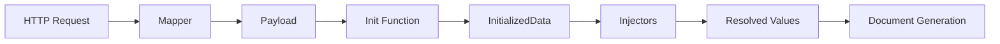

# Extensibility Guide

This guide explains how to extend pdf-forge with custom **injectors**, **mappers**, and **init functions** for document generation.

## Overview

The extensibility system allows you to:

- **Injectors**: Resolve dynamic values from external sources (CRM, databases, APIs)
- **Mapper**: Parse incoming request payloads into typed structures
- **Init Function**: Load shared data once before all injectors run



## Quick Start

1. Create your injector struct implementing `sdk.Injector`
2. Register it with `engine.RegisterInjector(&MyInjector{})`
3. Run the engine

```go
package main

import (
    "github.com/rendis/pdf-forge/sdk"
)

func main() {
    engine := sdk.New(
        sdk.WithConfigFile("config/app.yaml"),
        sdk.WithI18nFile("config/injectors.i18n.yaml"),
    )

    engine.RegisterInjector(&CustomerNameInjector{})
    engine.RegisterInjector(&InvoiceTotalInjector{})
    engine.RegisterMapper(&MyMapper{})
    engine.SetInitFunc(myInitFunc)

    if err := engine.Run(); err != nil {
        log.Fatal(err)
    }
}
```

## Project Structure

```plaintext
your-app/
├── main.go                    # Engine setup + extension registration
├── config/
│   ├── app.yaml               # Configuration
│   └── injectors.i18n.yaml    # Injectable translations
├── extensions/
│   ├── injectors/             # Your custom injectors
│   │   ├── customer_name.go
│   │   └── invoice_total.go
│   ├── mapper.go              # Request mapper
│   └── init.go                # Init function
└── go.mod
```

---

## Injectors

Injectors resolve dynamic values inserted into document templates. Each injector has a unique code that maps to a template variable.

### Interface

```go
type Injector interface {
    Code() string
    Resolve() (sdk.ResolveFunc, []string)  // func + dependency codes
    IsCritical() bool
    Timeout() time.Duration
    DataType() sdk.ValueType
    DefaultValue() *sdk.InjectableValue
    Formats() *sdk.FormatConfig
}
```

### Creating an Injector

```go
package injectors

import (
    "context"
    "time"

    "github.com/rendis/pdf-forge/sdk"
)

type CustomerNameInjector struct{}

func (i *CustomerNameInjector) Code() string { return "customer_name" }

func (i *CustomerNameInjector) Resolve() (sdk.ResolveFunc, []string) {
    return func(ctx context.Context, injCtx *sdk.InjectorContext) (*sdk.InjectorResult, error) {
        payload := injCtx.RequestPayload().(*MyPayload)
        return &sdk.InjectorResult{
            Value: sdk.StringValue(payload.CustomerName),
        }, nil
    }, nil // no dependencies
}

func (i *CustomerNameInjector) IsCritical() bool            { return true }
func (i *CustomerNameInjector) Timeout() time.Duration      { return 10 * time.Second }
func (i *CustomerNameInjector) DataType() sdk.ValueType     { return sdk.ValueTypeString }
func (i *CustomerNameInjector) DefaultValue() *sdk.InjectableValue { return nil }
func (i *CustomerNameInjector) Formats() *sdk.FormatConfig  { return nil }
```

### Value Types

```go
sdk.StringValue("text")           // string
sdk.NumberValue(123.45)           // float64
sdk.BoolValue(true)               // bool
sdk.TimeValue(time.Now())         // time.Time
sdk.TableValueData(table)         // table
sdk.ImageValue("https://...")     // image URL
sdk.ListValueData(list)           // list
```

### Dependencies Between Injectors

Injectors can depend on other injectors. Dependencies are resolved using topological sort:

```go
func (i *TotalPriceInjector) Resolve() (sdk.ResolveFunc, []string) {
    return func(ctx context.Context, injCtx *sdk.InjectorContext) (*sdk.InjectorResult, error) {
        unitPrice, _ := injCtx.GetResolved("unit_price")
        quantity, _ := injCtx.GetResolved("quantity")

        total := unitPrice.(float64) * quantity.(float64)
        return &sdk.InjectorResult{Value: sdk.NumberValue(total)}, nil
    }, []string{"unit_price", "quantity"} // dependencies
}
```

### i18n for Injectors

Add translations in `config/injectors.i18n.yaml`:

```yaml
groups:
  - key: billing
    name:
      en: "Billing"
      es: "Facturación"
    icon: "receipt"

customer_name:
  group: billing
  name:
    en: "Customer Name"
    es: "Nombre del Cliente"
  description:
    en: "Full name of the customer"
    es: "Nombre completo del cliente"
```

### Formatting

Injectors can specify format options that appear in the template editor.

#### Built-in Format Presets

| Preset      | Default Format     | Description             |
| ----------- | ------------------ | ----------------------- |
| Date        | `DD/MM/YYYY`       | Date formats            |
| Time        | `HH:mm`            | Time formats            |
| DateTime    | `DD/MM/YYYY HH:mm` | Combined date and time  |
| Number      | `#,##0.00`         | Number formatting       |
| Currency    | `$#,##0.00`        | Currency formatting     |
| Percentage  | `#,##0.00%`        | Percentage formatting   |
| Phone       | `+## # #### ####`  | Phone number formatting |
| RUT (Chile) | `##.###.###-#`     | Chilean RUT formatting  |
| Boolean     | `Yes/No`           | Boolean display options |

#### Using Format Options

```go
func (i *InvoiceDateInjector) DataType() sdk.ValueType { return sdk.ValueTypeTime }

func (i *InvoiceDateInjector) Formats() *sdk.FormatConfig {
    return &sdk.FormatConfig{
        Default: "DD/MM/YYYY",
        Options: []string{"DD/MM/YYYY", "MM/DD/YYYY", "YYYY-MM-DD", "D MMMM YYYY"},
    }
}
```

---

## Mapper

The mapper parses incoming HTTP request payloads. **Only ONE mapper is allowed** — if you need multiple document types, handle routing internally.

### Mapper Interface

```go
type RequestMapper interface {
    Map(ctx context.Context, mapCtx *sdk.MapperContext) (any, error)
}
```

`MapperContext` fields:

- `RawBody` — unparsed HTTP request body
- `Headers` — HTTP headers
- `ExternalID`, `TemplateID`, `TransactionalID`, `Operation` — request metadata

### Creating a Mapper

```go
package extensions

import (
    "context"
    "encoding/json"

    "github.com/rendis/pdf-forge/sdk"
)

type MyPayload struct {
    CustomerName string  `json:"customerName"`
    ProductID    string  `json:"productId"`
    Amount       float64 `json:"amount"`
}

type MyMapper struct{}

func (m *MyMapper) Map(ctx context.Context, mapCtx *sdk.MapperContext) (any, error) {
    var payload MyPayload
    if err := json.Unmarshal(mapCtx.RawBody, &payload); err != nil {
        return nil, err
    }
    return &payload, nil
}
```

### Internal Routing Pattern

Handle multiple document types inside a single mapper:

```go
func (m *MultiDocMapper) Map(ctx context.Context, mapCtx *sdk.MapperContext) (any, error) {
    docType := mapCtx.Headers["X-Document-Type"]
    switch docType {
    case "contract":
        return m.parseContract(mapCtx.RawBody)
    case "invoice":
        return m.parseInvoice(mapCtx.RawBody)
    default:
        return nil, fmt.Errorf("unknown document type: %s", docType)
    }
}
```

---

## Init Function

The init function runs **once before all injectors** and loads shared data. **Only ONE init function is allowed.**

### Creating an Init Function

```go
func myInitFunc(ctx context.Context, injCtx *sdk.InjectorContext) (any, error) {
    payload := injCtx.RequestPayload().(*MyPayload)

    customer, err := db.GetCustomer(ctx, payload.CustomerID)
    if err != nil {
        return nil, fmt.Errorf("failed to load customer: %w", err)
    }

    return &SharedData{Customer: customer}, nil
}
```

Register it:

```go
engine.SetInitFunc(myInitFunc)
```

### Accessing Init Data from Injectors

```go
func (i *MyInjector) Resolve() (sdk.ResolveFunc, []string) {
    return func(ctx context.Context, injCtx *sdk.InjectorContext) (*sdk.InjectorResult, error) {
        initData := injCtx.InitData().(*SharedData)
        return &sdk.InjectorResult{
            Value: sdk.StringValue(initData.Customer.Name),
        }, nil
    }, nil
}
```

### Init vs Injectors

| Use Init For                                 | Use Injectors For      |
| -------------------------------------------- | ---------------------- |
| Data needed by multiple injectors            | Single values          |
| Expensive operations (API calls, DB queries) | Simple transformations |
| Authentication/authorization checks          | Calculations           |
| Loading configuration                        | Formatting             |

---

## Context Values

Available from `InjectorContext`:

```go
injCtx.ExternalID()           // External identifier
injCtx.TemplateID()           // Template being used
injCtx.TransactionalID()      // For traceability
injCtx.Operation()            // Operation type
injCtx.Header("key")          // HTTP header value
injCtx.RequestPayload()       // Parsed payload from mapper
injCtx.InitData()             // Data from init function
injCtx.GetResolved("code")    // Value from another injector
injCtx.SelectedFormat("code") // Selected format for an injector
```

---

## Error Handling

```go
func (i *MyInjector) Resolve() (sdk.ResolveFunc, []string) {
    return func(ctx context.Context, injCtx *sdk.InjectorContext) (*sdk.InjectorResult, error) {
        value, err := fetchValue(ctx)
        if err != nil {
            // If IsCritical() returns true, this stops document generation
            // If false, the error is logged and the value is empty
            return nil, fmt.Errorf("failed to fetch value: %w", err)
        }
        return &sdk.InjectorResult{Value: sdk.StringValue(value)}, nil
    }, nil
}
```

## Timeout Configuration

```go
func (i *SlowInjector) Timeout() time.Duration {
    return 60 * time.Second  // Override default 30s
}

func (i *FastInjector) Timeout() time.Duration {
    return 0  // Use default 30s
}
```

---

## Troubleshooting

### Circular Dependencies

```plaintext
ERROR: circular dependency detected: injector_a -> injector_b -> injector_a
```

**Solution:** Refactor injectors to break the cycle. Consider moving shared logic to the init function.

### Missing i18n Translation

If an injector code has no translation, the code itself is displayed as the name.

**Solution:** Add the translation to `config/injectors.i18n.yaml`.

---

## WorkspaceInjectableProvider

For dynamic, workspace-specific injectables that are defined at runtime (not at startup), implement `WorkspaceInjectableProvider`.

### When to Use

- Injectables that vary by workspace (different workspaces have different available variables)
- Injectables fetched from external systems at runtime
- Dynamic injectables that can't be registered at startup

### Interface

```go
type WorkspaceInjectableProvider interface {
    // GetInjectables returns available injectables for a workspace.
    // Called when editor opens. Use injCtx.TenantCode() and injCtx.WorkspaceCode().
    GetInjectables(ctx context.Context, injCtx *entity.InjectorContext) (*GetInjectablesResult, error)

    // ResolveInjectables resolves a batch of injectable codes.
    // Return (nil, error) for CRITICAL failures that stop render.
    // Return (result, nil) with result.Errors for non-critical failures.
    ResolveInjectables(ctx context.Context, req *ResolveInjectablesRequest) (*ResolveInjectablesResult, error)
}
```

### Implementation Example

```go
type MyProvider struct{}

func (p *MyProvider) GetInjectables(ctx context.Context, injCtx *sdk.InjectorContext) (*sdk.GetInjectablesResult, error) {
    // Fetch available injectables for this workspace from your system
    // injCtx.TenantCode(), injCtx.WorkspaceCode() identify the workspace

    return &sdk.GetInjectablesResult{
        Injectables: []sdk.ProviderInjectable{
            {
                Code:        "customer_name",
                Label:       map[string]string{"es": "Nombre", "en": "Customer Name"},
                Description: map[string]string{"es": "Nombre del cliente", "en": "Full name of the customer"},
                DataType:    sdk.InjectableDataTypeText,
                GroupKey:    "customer_data",
            },
        },
        Groups: []sdk.ProviderGroup{
            {Key: "customer_data", Name: map[string]string{"es": "Datos", "en": "Customer Data"}, Icon: "user"},
        },
    }, nil
}

func (p *MyProvider) ResolveInjectables(ctx context.Context, req *sdk.ResolveInjectablesRequest) (*sdk.ResolveInjectablesResult, error) {
    values := make(map[string]*sdk.InjectableValue)

    for _, code := range req.Codes {
        // Resolve each code from your external system
        // Use req.Headers, req.Payload, req.InitData as needed
        val := sdk.StringValue("resolved value")
        values[code] = &val
    }

    return &sdk.ResolveInjectablesResult{Values: values}, nil
}
```

### Registration

```go
engine.SetWorkspaceInjectableProvider(&MyProvider{})
```

### Key Points

- **i18n**: Provider handles translations internally; return pre-translated `Label`, `Description`, and group `Name`
- **Code Collisions**: Provider codes must not conflict with registry injector codes (error on collision)
- **Groups**: Provider can define custom groups that merge with YAML-defined groups
- **Error Handling**: Return `(nil, error)` for critical failures; use `result.Errors` for non-critical

---

## Custom Render Authentication

By default, render endpoints use OIDC authentication (panel provider + render_providers). For custom authentication (API keys, custom JWT, etc.), implement `RenderAuthenticator`.

### When to Use

- API key authentication for service-to-service calls
- Custom JWT validation (different from configured OIDC)
- Hybrid authentication (try OIDC, fallback to API key)
- Custom authorization logic before standard auth

### Interface

```go
type RenderAuthenticator interface {
    // Authenticate validates the request and returns claims.
    // Return (claims, nil) if valid.
    // Return (nil, error) to reject with 401.
    Authenticate(c *gin.Context) (*RenderAuthClaims, error)
}

type RenderAuthClaims struct {
    UserID   string         // Caller identifier (required for audit/tracing)
    Email    string         // Email (optional)
    Name     string         // Name (optional)
    Provider string         // Name of the auth provider/method used
    Extra    map[string]any // Additional custom claims
}
```

### Behavior

| Custom Auth Registered | Render Endpoints                          | Panel Endpoints           |
|------------------------|-------------------------------------------|---------------------------|
| NO                     | Uses OIDC (panel + render_providers)      | Uses panel OIDC           |
| YES                    | Uses custom auth, ignores OIDC for render | Panel OIDC still works    |

**Panel OIDC always works** for login/UI, independent of custom render auth.

### API Key Authentication Example

```go
type APIKeyAuthenticator struct {
    validKeys map[string]string // key → userID
}

func (a *APIKeyAuthenticator) Authenticate(c *gin.Context) (*sdk.RenderAuthClaims, error) {
    apiKey := c.GetHeader("X-API-Key")
    if apiKey == "" {
        return nil, errors.New("missing API key")
    }

    userID, ok := a.validKeys[apiKey]
    if !ok {
        return nil, errors.New("invalid API key")
    }

    return &sdk.RenderAuthClaims{
        UserID:   userID,
        Provider: "api-key",
        Extra:    map[string]any{"api_key_prefix": apiKey[:8]},
    }, nil
}

// Registration
engine.SetRenderAuthenticator(&APIKeyAuthenticator{
    validKeys: map[string]string{
        "sk_live_xxx": "service-account-1",
        "sk_live_yyy": "service-account-2",
    },
})
```

### Custom JWT Example

```go
type CustomJWTAuth struct {
    secret []byte
}

func (a *CustomJWTAuth) Authenticate(c *gin.Context) (*sdk.RenderAuthClaims, error) {
    tokenStr := extractBearerToken(c)
    if tokenStr == "" {
        return nil, errors.New("missing token")
    }

    claims, err := jwt.Parse(tokenStr, a.secret)
    if err != nil {
        return nil, err
    }

    return &sdk.RenderAuthClaims{
        UserID:   claims["sub"].(string),
        Email:    claims["email"].(string),
        Provider: "custom-jwt",
    }, nil
}
```

### Hybrid Authentication Example

Try Bearer token first, fallback to API key:

```go
type HybridAuth struct {
    oidcValidator *OIDCValidator
    apiKeys       map[string]string
}

func (a *HybridAuth) Authenticate(c *gin.Context) (*sdk.RenderAuthClaims, error) {
    // Try Bearer token first
    if token := c.GetHeader("Authorization"); strings.HasPrefix(token, "Bearer ") {
        claims, err := a.oidcValidator.Validate(token[7:])
        if err == nil {
            return &sdk.RenderAuthClaims{
                UserID:   claims.Subject,
                Email:    claims.Email,
                Provider: "oidc",
            }, nil
        }
    }

    // Fallback to API key
    if key := c.GetHeader("X-API-Key"); key != "" {
        if userID, ok := a.apiKeys[key]; ok {
            return &sdk.RenderAuthClaims{
                UserID:   userID,
                Provider: "api-key",
            }, nil
        }
    }

    return nil, errors.New("no valid credentials")
}
```

### Accessing Claims in Middleware/Controllers

Claims are stored in gin context with same keys as OIDC:

```go
// In custom middleware or controller
userID, _ := c.Get("user_id")
email, _ := c.Get("user_email")
name, _ := c.Get("user_name")
provider, _ := c.Get("oidc_provider") // contains custom Provider name

// Extra claims from RenderAuthClaims.Extra
extra := middleware.GetRenderAuthExtra(c) // returns map[string]any or nil
```

### Registration

```go
engine.SetRenderAuthenticator(&MyAuthenticator{})
```

### Key Points

- **Replaces OIDC for render**: When registered, OIDC render_providers are ignored
- **Panel unaffected**: Panel OIDC always works for login/UI
- **Same context keys**: Claims stored using same keys as OIDC for compatibility
- **Extra claims**: Use `Extra` map for custom claims, access via `middleware.GetRenderAuthExtra(c)`
